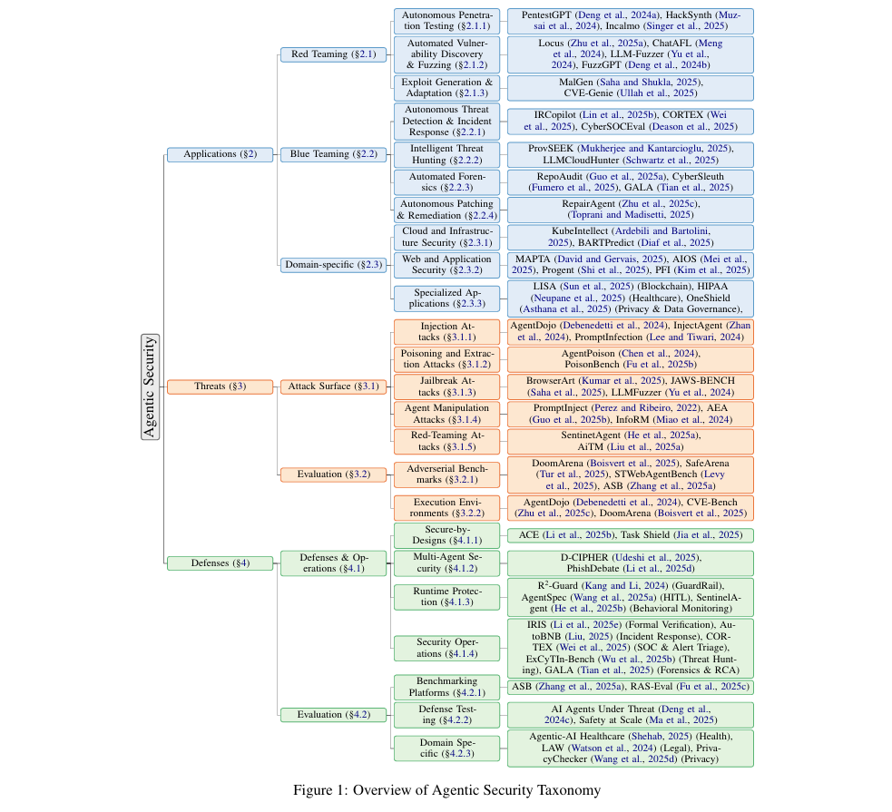

# Awesome Agentic Security Papers 📑

<p align="center">
  <a href="https://arxiv.org/abs/2510.06445">
    
  </a>
  <a href="https://opensource.org/licenses/MIT">
    
  </a>
  <a href="http://makeapullrequest.com">
    
  </a>
</p>


<p align="center"><strong>A Survey on Agentic Security: Applications, Threats and Defenses
</strong></p>
<p align="center"></p>
<!-- First Part (Original) -->
<p align="center"><strong>Authors:</strong> Asif Shahriar*, Md Nafiu Rahman*, Sadif Ahmed*, Farig Sadeque, Md Rizwan Parvez</p>
<p align="center">BRAC University, Qatar Computing Research Institute (QCRI)</p>

<div align="center">
    
</div>

<hr/>

If you find this survey or repository useful, please cite our work:

```bibtex
@article{shahriar2025agentic,
  title={A Survey on Agentic Security: Applications, Threats and Defenses},
  author={Shahriar, Asif and Rahman, Md Nafiu and Ahmed, Sadif and Sadeque, Farig and Parvez, Md Rizwan},
  journal={arXiv preprint arXiv:2510.06445},
  year={2025}
}
```
## Contributing to this paper list

Feel free to **open an issue/PR** or e-mail [asif.asr11@gmail.com](mailto:asif.asr11@gmail.com) if you find any missing areas, papers, or benchmarks. We will keep updating this list and survey.

## Survey Introduction

The move from passive language models to autonomous LLM-agents marks a major shift in cybersecurity. These agents can act on their own. They can help with both attacking and defending systems, yet they also create new risks because they make decisions and interact with the world in more complex ways. This gives attackers more paths to mislead or control them.

This repository gathers the resources, taxonomy, and papers linked to the survey “A Survey on Agentic Security: Applications, Threats and Defenses.” The survey offers a clear overview of the security issues that come with autonomous agents. It centers on three questions. What agents can do for security. How agents can be attacked. How they can be protected.

In the survey. we explain the agentic security landscape through three main points:

1. How agents help with offensive and defensive security tasks.

2. Where agents are vulnerable, such as hidden prompts in outside content or harmful data written into memory.

3. How defenders can protect agents so they act safely and reliably.

This overview aims to support more research on agentic security. The goal is to use the strengths of autonomous agents while reducing the risks they bring. This will guide the development of systems that deliver real benefits while keeping harm low.

---

## Table of Contents

* [Survey Introduction](#survey-introduction)
* [Table of Contents](#table-of-contents)
* [Related Surveys for LLMs Evaluation](#related-surveys-for-llms-evaluation)
* [Papers](#papers)
    * [Applications](#applications)
        * [Red-Teaming](#red-teaming)
          * [Autonomous Penetration Testing](#autonomous-penetration-testing)
          * [Automated Vulnerability Discovery & Fuzzing](#automated-vulnerability-discovery--fuzzing)
          * [Exploit Generation](#exploit-generation)
        * [Blue-Teaming](#blue-teaming)
          * [Autonomous Threat Detection](#autonomous-threat-detection)
          * [Intelligent Threat Hunting](#intelligent-threat-hunting)
          * [Automated Forensics](#automated-forensics)
          * [Autonomous Patching](#autonomous-patching)
        * [Domain-Specific Applications](#domain-specific-applications)
          * [Cloud & Infrastructure Security](#cloud--infrastructure-security)
          * [Web & Application Security](#web--application-security)
          * [Specialized Domains](#specialized-domains)
       
      
    * [Threats](#threats)
        * [Attack Surface](#attack-surface)
          * [Injection Attacks](#injection-attacks)
          * [Poisoning & Extraction Attacks](#poisoning--extraction-attacks)
          * [Jailbreak Attacks](#jailbreak-attacks)
          * [Agent Manipulation Attacks](#agent-manipulation-attacks)
          * [Red-Teaming Attacks](#red-teaming-attacks)
        * [Evaluation](#evaluation)
          * [Adversarial Benchmarks](#adversarial-benchmarks)
          * [Execution Environments](#execution-environments)
      
    * [Defenses](#defenses)
        * [Defense & Operations](#defense--operations)
          * [Secure-by-Design Architectures](#secure-by-design-architectures)
          * [Multi-Agent Security](#multi-agent-security)
          * [Runtime Protection](#runtime-protection)
          * [Security Operations](#security-operations)
        * [Evaluation](#evaluation-1)
          * [Benchmarking Platforms](#benchmarking-platforms)
          * [Defense Testing](#defense-testing)

## Papers

### Applications

#### Red-Teaming

##### Autonomous Penetration Testing

1.  PentestGPT: **"PentestGPT: An LLM-empowered Automatic Penetration Testing Tool"**. 
    *Gelei Deng et al.* USENIX Security 2024. [[Paper](https://www.usenix.org/system/files/usenixsecurity24-deng.pdf)]

2.  PentestAgent: **"PentestAgent: Incorporating LLM Agents to Automated Penetration Testing"**.
    *Xiangmin Shen et al.* ASIA CCS 2025. [[Paper](https://dl.acm.org/doi/10.1145/3708821.3733882)]

3.  Vulnbot: **"VulnBot: Autonomous Penetration Testing for A Multi-Agent Collaborative Framework"**. 
    *He Kong et al.* arXiv 2025. [[Paper](https://arxiv.org/abs/2501.13411)]

4.  Aracne: **"Aracne: An LLM-based Autonomous Shell Pentesting Agent"**.
    *Tomas Nieponice et al.* arXiv 2025. [[Paper](https://arxiv.org/abs/2502.18528)]

5.  Enterprise-Test: **"Can LLMs Hack Enterprise Networks? Autonomous Assumed Breach Penetration-Testing Active Directory Networks"**. 
    *Andreas Happe and Jürgen Cito.* ACM Trans. Softw. Eng. Methodol. 2025. [[Paper](https://dl.acm.org/doi/10.1145/3766895)]

6.  HackSynth: **"Hacksynth: LLM Agent and Evaluation Framework for Autonomous Penetration Testing"**. 
    *Lajos Muzsai et al.* arXiv 2024. [[Paper](https://arxiv.org/abs/2412.01778)]

7.  AutoPentest: **"AutoPentest: Enhancing Vulnerability Management with Autonomous LLM Agents"**. 
    *Julius Henke.* arXiv 2025. [[Paper](https://arxiv.org/abs/2505.10321)]

8.  LLM-Pentest-Efficacy: **"On the Surprising Efficacy of LLMs for Penetration-Testing"**. 
    *Andreas Happe and Jürgen Cito.* arXiv 2025. [[Paper](https://arxiv.org/abs/2507.00829)]

9.  Incalmo: **"Incalmo: An Autonomous LLM-assisted System for Red Teaming Multi-Host Networks"**. 
    *Brian Singer et al.* arXiv 2025. [[Paper](https://arxiv.org/abs/2501.16466)]

10. xOffense: **"xOffense: An AI-Driven Autonomous Penetration Testing Framework with Offensive Knowledge-Enhanced LLMs and Multi Agent Systems"**. 
    *Phung Duc Luong et al.* arXiv 2025. [[Paper](https://arxiv.org/abs/2509.13021)]

11. AutoPenBench: **"AutoPenBench: Benchmarking Generative Agents for Penetration Testing"**. 
    *Luca Gioacchini et al.* arXiv 2024. [[Paper](https://arxiv.org/abs/2410.03225)]

12. AI-Pentest-Benchmark: **"Towards automated penetration testing: Introducing LLM Benchmark, Analysis, and Improvements"**. 
    *Isamu Isozaki et al.* arXiv 2024. [[Paper](https://arxiv.org/abs/2410.17141)]

##### Automated Vulnerability Discovery & Fuzzing

1.  Locus: **"Locus: Agentic Predicate Synthesis for Directed Fuzzing"**.
    *Jie Zhu et al.* arXiv 2025. [[Paper](https://arxiv.org/abs/2508.21302)]

2.  ChatAFL: **"Large Language Model Guided Protocol Fuzzing"**. 
    *Ruijie Meng et al.* NDSS 2024. [[Paper](https://www.ndss-symposium.org/ndss-paper/large-language-model-guided-protocol-fuzzing/)]

3.  One-Day-Exploits: **"LLM Agents Can Autonomously Exploit One-Day Vulnerabilities"**. [cite: 52, 430]
    *Richard Fang et al.* arXiv 2024. [[Paper](https://arxiv.org/abs/2404.08144)]

4.  Zero-Day-Teams: **"Teams of LLM Agents Can Exploit Zero-Day Vulnerabilities"**. 
    *Yuxuan Zhu et al.* arXiv 2025. [[Paper](https://arxiv.org/abs/2406.01637)]

5.  Android-Discovery: **"Agentic Discovery and Validation of Android App Vulnerabilities"**. 
    *Ziyue Wang and Liyi Zhou.* arXiv 2025. [[Paper](https://arxiv.org/abs/2508.21579)]

6.  Sec-Bench: **"Sec-bench: Automated Benchmarking of LLM Agents on Real-World Software Security Tasks"**. 
    *Hwiwon Lee et al.* arXiv 2025. [[Paper](https://arxiv.org/abs/2506.11791)]

7.  CVE-Bench (Web): **"CVE-Bench: A Benchmark for AI Agents' Ability to Exploit Real-World Web Application Vulnerabilities"**. 
    *Yuxuan Zhu et al.* arXiv 2025. [[Paper](https://arxiv.org/abs/2503.17332)]

8.  CVE-bench (Repair): **"CVE-bench: Benchmarking LLM-based Software Engineering Agent's Ability to Repair Real-World CVE Vulnerabilities"**. 
    *Peiran Wang et al.* NAACL 2025. [[Paper](https://aclanthology.org/2025.naacl-long.212/)]

9.  ExCyTInBench: **"Excytin-bench: Evaluating LLM Agents on Cyber Threat Investigation"**. 
    *Yiran Wu et al.* arXiv 2025. [[Paper](https://arxiv.org/abs/2507.14201)]

10. LLM-Fuzzer: **"LLM-Fuzzer: Scaling Assessment of Large Language Model Jailbreaks"**. 
    *Jiahao Yu et al.* USENIX Security 2024. [[Paper](https://www.usenix.org/system/files/usenixsecurity24-yu-jiahao.pdf)]

11. TitanFuzz: **"Large Language Models Are Zero-Shot Fuzzers: Fuzzing Deep-Learning Libraries via Large Language Models"**. 
    *Yinlin Deng et al.* ISSTA 2023. [[Paper](https://dl.acm.org/doi/10.1145/3597926.3598067)]

12. FuzzGPT: **"Large Language Models Are Edge-Case Generators: Crafting Unusual Programs for Fuzzing Deep Learning Libraries"**.
    *Yinlin Deng et al.* ICSE 2024. [[Paper](https://dl.acm.org/doi/10.1145/3597503.3623343)]

##### Exploit Generation

1.  Dark-Side-Agents: **"The Dark Side of LLMs: Agent-Based Attacks for Complete Computer Takeover"**. 
    *Matteo Lupinacci et al.* arXiv 2025. [[Paper](https://arxiv.org/abs/2507.06850)]

2.  MalGen: **"MalGen: A Generative Agent Framework for Modeling Malicious Software in Cybersecurity"**. 
    *Bikash Saha and Sandeep Kumar Shukla.* arXiv 2025. [[Paper](https://arxiv.org/abs/2506.07586)]

3.  AiTM: **"Red-Teaming LLM Multi-Agent Systems via Communication Attacks"**. 
    *Pengfei He et al.* ACL 2025. [[Paper](https://aclanthology.org/2025.findings-acl.349/)]

4.  CVE-Genie: **"From CVE Entries to Verifiable Exploits: An Automated Multi-Agent Framework for Reproducing CVEs"**. 
    *Saad Ullah et al.* arXiv 2025. [[Paper](https://arxiv.org/abs/2509.01835)]

5.  LLM4CVE: **"LLM4CVE: Enabling Iterative Automated Vulnerability Repair with Large Language Models"**. 
    *Mohamad Fakih et al.* arXiv 2025. [[Paper](https://arxiv.org/abs/2501.03446)]

#### Blue-Teaming

##### Autonomous Threat Detection

1.  RAG-Incident-Response: **"Advancing Autonomous Incident Response: Leveraging LLMs and Cyber Threat Intelligence"**. 
    *Amine Tellache et al.* arXiv 2025. [[Paper](https://arxiv.org/abs/2508.10677)]

2.  IRCopilot: **"RCopilot: Automated Incident Response with Large Language Models"**. 
    *Xihuan Lin et al.* arXiv 2025. [[Paper](https://arxiv.org/abs/2505.20945)]

3.  CORTEX: **"Cortex: Collaborative LLM Agents for High-Stakes Alert Triage"**.
    *Bowen Wei et al.* arXiv 2025. [[Paper](https://arxiv.org/abs/2510.00311)]

4.  AutoBnB: **"AutoBnB: Multi-Agent Incident Response with Large Language Models"**. 
    *Zefang Liu.* ISDFS 2025. [[Paper](https://ieeexplore.ieee.org/document/11012055)]

5.  SOC-Empirical-Study: **"LLMs in the SOC: An Empirical Study of Human-AI Collaboration in Security Operations Centres"**. 
    *Ronal Singh et al.* arXiv 2025. [[Paper](https://arxiv.org/abs/2508.18947)]

6.  CyberSOCEval: **"CyberSOCEval: Benchmarking LLMs Capabilities for Malware Analysis and Threat Intelligence Reasoning"**.
    *Lauren Deason et al.* arXiv 2025. [[Paper](https://arxiv.org/abs/2509.20166)]

7.  Log-Analysis-Survey: **"Automated Threat Detection and Response Using LLM Agents"**.
    *Ramasankar Molleti et al.* World Journal of Advanced Research and Reviews 2024. [[Paper](https://wjarr.com/sites/default/files/WJARR-2024-3329.pdf)]

##### Intelligent Threat Hunting

1.  ProvSEEK: **"LLM-Driven Provenance Forensics for Threat Investigation and Detection"**. 
    *Kunal Mukherjee and Murat Kantarcioglu.* arXiv 2025. [[Paper](https://arxiv.org/abs/2508.21323)]

2.  CTI-Vulnerabilities: **"Uncovering Vulnerabilities of LLM-Assisted Cyber Threat Intelligence"**. 
    *Yuqiao Meng et al.* arXiv 2025. [[Paper](https://arxiv.org/abs/2509.23573)]

3.  LLMCloudHunter: **"LLMCloudHunter: Harnessing LLMs for Automated Extraction of Detection Rules from Cloud-Based CTI"**. 
    *Yuval Schwartz et al.* WWW 2025. [[Paper](https://dl.acm.org/doi/10.1145/3696410.3714798)]

##### Automated Forensics

1.  RepoAudit: **"RepoAudit: An Autonomous LLM-Agent for Repository-Level Code Auditing"**. 
    *Jinyao Guo et al.* ICML 2025. [[Paper](https://openreview.net/pdf?id=TXcifVbFpG)]

2.  Cloud-Forensics: **"LLM-Powered Automated Cloud Forensics: From Log Analysis to Investigation"**. 
    *Dalal Alharthi and Rozhin Yasaei.* IEEE CLOUD 2025 . [[Paper](https://ieeexplore.ieee.org/document/11120597)]

3.  CyberSleuth: **"CyberSleuth: Autonomous Blue-Team LLM Agent for Web Attack Forensics"**. 
    *Stefano Fumero et al.* arXiv 2025. [[Paper](https://arxiv.org/abs/2508.20643)]

4.  GALA: **"GALA: Can Graph-Augmented Large Language Model Agentic Workflows Elevate Root Cause Analysis?"**. 
    *Yifang Tian et al.* arXiv 2025. [[Paper](https://arxiv.org/abs/2508.12472)]

5.  MAST: **"Why Do Multiagent Systems Fail?"**. 
    *Melissa Z Pan et al.* ICLR Workshop 2025. [[Paper](https://openreview.net/pdf?id=wM521FqPvI)]

6.  CIAF: **"Cloud Investigation Automation Framework (CIAF): An AI-Driven Approach to Cloud Forensics"**. 
    *Dalal Alharthi and Ivan Roberto Kawaminami Garcia.* arXiv 2025. [[Paper](https://arxiv.org/abs/2510.00452)]

##### Autonomous Patching

1.  CVE-Bench (Repair): **"CVE-Bench: A Benchmark for AI Agents’ Ability to Exploit Real-World Web Application Vulnerabilities"**. 
    *Yuxuan Zhu et al.* ICML 2025. [[Paper](https://openreview.net/pdf?id=3pk0p4NGmQ)]

2.  RepairAgent: **"RepairAgent: An Autonomous, LLM-Based Agent for Program Repair"**. 
    *Islem Bouzenia et al.* ICSE 2025. [[Paper](https://dl.acm.org/doi/10.1109/ICSE55347.2025.00157)]

3.  Gemini-Patching: **"AI-Powered Patching: The Future of Automated Vulnerability Fixes"**. 
    *Jan Keller and Jan Nowakowski.* Technical Report 2024. [[Link](https://research.google/pubs/ai-powered-patching-the-future-of-automated-vulnerability-fixes/)]

4.  IaC-Remediation: **"LLM Agentic Workflow for Automated Vulnerability Detection and Remediation in Infrastructure-as-Code"**. 

    *Dheer Toprani and Vijay K. Madisetti.* IEEE Access 2025. [[Paper](https://ieeexplore.ieee.org/document/10965635)]

#### Domain-Specific Applications

##### Cloud & Infrastructure Security

1.  Cloud-Infra-AI: **"Cloud Infrastructure Management in the Age of AI Agents"**. 
    *Zhenning Yang et al.* ACM SIGOPS Operating Systems Review 2025. [[Paper](https://dl.acm.org/doi/10.1145/3759441.3759443)]

2.  KubeIntellect: **"KubeIntellect: A Modular LLM-Orchestrated Agent Framework for End-to-End Kubernetes Management"**. 
    *Mohsen Seyedkazemi Ardebili and Andrea Bartolini.* 2025. [[Paper](https://arxiv.org/abs/2509.02449)]

3.  LLMSecConfig: **"LLMSecConfig: An LLM-Based Approach for Fixing Software Container Misconfigurations"**.
    *Ziyang Ye et al.* 2025. [[Paper](https://www.computer.org/csdl/proceedings-article/msr/2025/018300a629/27vTruUNcXe)]

4.  BARTPredict: **"BARTPredict: Empowering IoT Security with LLM-Driven Cyber Threat Prediction"**. 
    *Alaeddine Diaf et al.* 2025. [[Paper](https://ieeexplore.ieee.org/document/10901770)]

5.  IaC-Remediation: **"LLM Agentic Workflow for Automated Vulnerability Detection and Remediation in Infrastructure-as-Code"**. 
    *Dheer Toprani and Vijay K. Madisetti.* IEEE Access 2025. [[Paper](https://ieeexplore.ieee.org/document/10965635)]

##### Web & Application Security

1.  MAPTA: **"Multi-Agent Penetration Testing AI for the Web"**. 
    *Isaac David and Arthur Gervais.* 2025. [[Paper](https://arxiv.org/abs/2508.20816)]

2.  Browsing-Dangers: **"The Hidden Dangers of Browsing AI Agents"**. 
    *Mykyta Mudryi et al.* 2025. [[Paper](https://papers.ssrn.com/sol3/papers.cfm?abstract_id=5290351)]

3.  AIOS: **"AIOS: LLM Agent Operating System"**. 
    *Kai Mei et al.* Conference on Language Modeling 2025. [[Paper](https://openreview.net/pdf?id=L4HHkCDz2x)]

4.  OS-Agents-Survey: **"OS Agents: A Survey on MLLM-based Agents for Computer, Phone and Browser Use"**. 
    *Xueyu Hu et al.* 2025. [[Paper](https://aclanthology.org/2025.acl-long.369/)]

5.  Prompt-Flow-Integrity: **"Prompt Flow Integrity to Prevent Privilege Escalation in LLM Agents"**. 
    *Juhee Kim et al.* 2025. [[Paper](https://arxiv.org/abs/2503.15547)]

6.  Progent: **"Progent: Programmable Privilege Control for LLM Agents"**. 
    *Tianneng Shi et al.* 2025. [[Paper](https://arxiv.org/abs/2504.11703)]

##### Specialized Domains

1.  LISA: **"LISA Technical Report: An Agentic Framework for Smart Contract Auditing"**. 
    *Izaiah Sun et al.* 2025. [[Paper](https://arxiv.org/abs/2509.24698)]

2.  SmartLLM: **"SmartLLM: Smart Contract Auditing Using Custom Generative AI"**. 
    *Jun Kevin and Pujianto Yugopuspito.* 2025. [[Paper](https://ieeexplore.ieee.org/document/11019687)]

3.  FineTuning-Auditing: **"Combining Fine-Tuning and LLM-Based Agents for Intuitive Smart Contract Auditing with Justifications"**. 
    *Wei Ma et al.* 2024. [[Paper](https://dl.acm.org/doi/10.1109/ICSE55347.2025.00027)]

4.  AuditGPT: **"AuditGPT: Auditing Smart Contracts with ChatGPT"**. 
    *Shihao Xia et al.* 2024. [[Paper](http://arxiv.org/abs/2404.04306)]

5.  HIPAA-Agent: **"Towards a HIPAA Compliant Agentic AI System in Healthcare"**. 
    *Subash Neupane et al.* 2025. [[Paper](https://arxiv.org/abs/2504.17669)]

6.  OneShield: **"Deploying Privacy Guardrails for LLMs: A Comparative Analysis of Real-World Applications"**. 
    *Shubhi Asthana et al.* 2025. [[Paper](https://arxiv.org/abs/2501.12456)]

7.  Embodied-AI-Security: **"Towards Robust and Secure Embodied AI: A Survey on Vulnerabilities and Attacks"**. 
    *Wenpeng Xing et al.* 2025. [[Paper](https://arxiv.org/abs/2502.13175)]

### Threats

#### Attack Surface

##### Injection Attacks

1.  Polymorphic Prompt: **"To Protect the LLM Agent Against the Prompt Injection Attack with Polymorphic Prompt"**.
    *Zhilong Wang et al.* arXiv 2025. [[Paper](https://arxiv.org/abs/2506.05739)]

2.  AgentDojo: **"AgentDojo: A Dynamic Environment to Evaluate Prompt Injection Attacks and Defenses for LLM Agents"**. 
    *Edoardo Debenedetti et al.* NeurIPS 2024. [[Paper](https://arxiv.org/abs/2406.13387)]

3.  App-Injection: **"Prompt Injection Attack Against LLM-Integrated Applications"**.
    *Yi Liu et al.* arXiv 2024. [[Paper](https://arxiv.org/abs/2306.05499)]

4.  InjecAgent: **"InjecAgent: Benchmarking Indirect Prompt Injections in Tool-Integrated Large Language Model Agents"**. 
    *Qiusi Zhan et al.* ACL 2024. [[Paper](https://arxiv.org/abs/2403.02691)]

5.  Commercial-Vuln: **"Commercial LLM Agents Are Already Vulnerable to Simple Yet Dangerous Attacks"**.
    *Ang Li et al.* arXiv 2025. [[Paper](https://arxiv.org/abs/2502.08586)]

6.  Indirect-Bench: **"Benchmarking and Defending Against Indirect Prompt Injection Attacks on Large Language Models"**. 
    *Jingwei Yi et al.* KDD 2025.

7.  Prompt Infection: **"Prompt Infection: LLM-to-LLM Prompt Injection Within Multi-Agent Systems"**.
    *Donghyun Lee and Mo Tiwari.* arXiv 2024. [[Paper](https://arxiv.org/abs/2410.07283)]

8.  Memory Injection: **"A Practical Memory Injection Attack Against LLM Agents"**.
    *Shen Dong et al.* arXiv 2025. [[Paper](https://arxiv.org/abs/2503.03704)]

9.  Data Leakage: **"Simple Prompt Injection Attacks Can Leak Personal Data Observed by LLM Agents During Task Execution"**.
    *Meysam Alizadeh et al.* arXiv 2025. [[Paper](https://arxiv.org/abs/2506.01055)]

10. AgentVigil: **"AgentVigil: Generic Black-Box Red-Teaming for Indirect Prompt Injection Against LLM Agents"**.
    *Zhun Wang et al.* arXiv 2025. [[Paper](https://arxiv.org/abs/2505.05849)]

11. ASB: **"Agent Security Bench (ASB): Formalizing and Benchmarking Attacks and Defenses in LLM-Based Agents"**. 
    *Hanrong Zhang et al.* ICLR 2025. [[Paper](https://openreview.net/forum?id=...)]

12. AgentHarm: **"AgentHarm: A Benchmark for Measuring Harmfulness of LLM Agents"**. 
    *Maksym Andriushchenko et al.* ICLR 2025. [[Paper](https://arxiv.org/abs/2410.09024)]

13. Adaptive Attacks: **"Adaptive Attacks Break Defenses Against Indirect Prompt Injection Attacks on LLM Agents"**.
    *Qiusi Zhan et al.* NAACL 2025. [[Paper](https://aclanthology.org/2025.findings-naacl.499/)]

##### Poisoning & Extraction Attacks

1.  Poisoning Review: **"A Systematic Review of Poisoning Attacks Against Large Language Models"**.
    *Neil Fendley et al.* arXiv 2025. [[Paper](https://arxiv.org/abs/2506.06518)]

2.  AgentPoison: **"AgentPoison: Red-Teaming LLM Agents via Poisoning Memory or Knowledge Bases"**.
    *Zhaorun Chen et al.* NeurIPS 2024. [[Paper](https://arxiv.org/abs/2407.12784)]

3.  PoisonBench: **"PoisonBench: Assessing Large Language Model Vulnerability to Poisoned Preference Data"**. 
    *Tingchen Fu et al.* ICML 2025.

4.  Poisoning Trends: **"Scaling Trends for Data Poisoning in LLMs"**.
    *Dillon Bowen et al.* AAAI 2025.

5.  Ad Embedding: **"Attacking LLMs and AI Agents: Advertisement Embedding Attacks Against Large Language Models"**.
    *Qiming Guo et al.* arXiv 2025. [[Paper](https://arxiv.org/abs/2508.17674)]

##### Jailbreak Attacks

1.  Browser Agents: **"Aligned LLMs Are Not Aligned Browser Agents"**.
    *Priyanshu Kumar et al.* ICLR 2025. [[Paper](https://arxiv.org/abs/2405.18561)]

2.  Web Vulnerability: **"Why Are Web AI Agents More Vulnerable Than Standalone LLMs? A Security Analysis"**.
    *Jeffrey Yang Fan Chiang et al.* ICLR Workshop 2025.

3.  Code Jailbreak: **"Breaking the Code: Security Assessment of AI Code Agents Through Systematic Jailbreaking Attacks"**.
    *Shoumik Saha et al.* arXiv 2025. [[Paper](https://arxiv.org/abs/2510.01359)]

4.  LLM-Fuzzer: **"LLM-Fuzzer: Scaling Assessment of Large Language Model Jailbreaks"**.
    *Jiahao Yu et al.* USENIX Security 2024. [[Paper](https://www.usenix.org/conference/usenixsecurity24/presentation/yu-jiahao)]

5.  Many-Shot: **"Many-Shot Jailbreaking"**.
    *Cem Anil et al.* NeurIPS 2024. [[Paper](https://arxiv.org/abs/2404.08138)]

6.  Robot Jailbreak: **"Jailbreaking LLM-Controlled Robots"**.
    *Alexander Robey et al.* arXiv 2024. [[Paper](https://arxiv.org/abs/2410.13691)]

##### Agent Manipulation Attacks

1.  Ignore Prompt: **"Ignore Previous Prompt: Attack Techniques for Language Models"**.
    *Fábio Perez and Ian Ribeiro.* arXiv 2022. [[Paper](https://arxiv.org/abs/2211.09527)]

2.  CAIN: **"CAIN: Hijacking LLM-Humans Conversations via Malicious System Prompts"**.
    *Viet Pham and Thai Le.* arXiv 2025. [[Paper](https://arxiv.org/abs/2505.16888)]

3.  Goal Hijacking: **"Pseudo-Conversation Injection for LLM Goal Hijacking"**.
    *Zheng Chen and Buhui Yao.* arXiv 2024. [[Paper](https://arxiv.org/abs/2410.23678)]

4.  Action Hijacking: **"Towards Action Hijacking of Large Language Model-Based Agent"**.
    *Yuyang Zhang et al.* arXiv 2025. [[Paper](https://arxiv.org/abs/2412.10807)]

5.  InfoRM: **"InfoRM: Mitigating Reward Hacking in RLHF via Information-Theoretic Reward Modeling"**.
    *Yuchun Miao et al.* 2024.

6.  Reward Shaping: **"Reward Shaping to Mitigate Reward Hacking in RLHF"**.
    *Jiayi Fu et al.* arXiv 2025. [[Paper](https://arxiv.org/abs/2502.18770)]

7.  Spec Gaming: **"Demonstrating Specification Gaming in Reasoning Models"**.
    *Alexander Bondarenko et al.* arXiv 2025. [[Paper](https://arxiv.org/abs/2502.13295)]

8.  Byzantine MARL: **"Byzantine Robust Cooperative Multi-Agent Reinforcement Learning as a Bayesian Game"**.
    *Simin Li et al.* ICLR 2024. [[Paper](https://openreview.net/forum?id=z6KS9D1dxt&noteId=bmQTLbJlRL)]

9.  Byzantine Coord: **"Byzantine-Robust Decentralized Coordination of LLM Agents"**.
    *Yongrae Jo and Chanik Park.* arXiv 2025. [[Paper](https://arxiv.org/abs/2507.14928)]

##### Red-Teaming Attacks

1.  Red Teaming LMs: **"Red Teaming Language Models with Language Models"**.
    *Ethan Perez et al.* arXiv 2022. [[Paper](https://arxiv.org/abs/2202.03286)]

2.  MART: **"MART: Improving LLM Safety with Multi-Round Automatic Red-Teaming"**.
    *Suyu Ge et al.* arXiv 2023. [[Paper](https://arxiv.org/abs/2311.07689)]

3.  Comm Attacks: **"Red-Teaming LLM Multi-Agent Systems via Communication Attacks"**.
    *Pengfei He et al.* ACL 2025. [[Paper](https://aclanthology.org/2025.findings-acl.415/)]

4.  Agent-in-the-Middle: **"Make Agent Defeat Agent: Automatic Detection of Taint-Style Vulnerabilities in LLM-Based Agents"**.
    *Fengyu Liu et al.* USENIX Security 2025. [[Paper](https://www.usenix.org/conference/usenixsecurity25/presentation/liu-fengyu)]

5.  Privacy Risks: **"Searching for Privacy Risks in LLM Agents via Simulation"**.
    *Yanzhe Zhang and Diyi Yang.* arXiv 2025. [[Paper](https://arxiv.org/abs/2508.10880)]

#### Evaluation

##### Adversarial Benchmarks

1.  ASB: **"Agent Security Bench (ASB): Formalizing and Benchmarking Attacks and Defenses in LLM-Based Agents"**. 
    *Hanrong Zhang et al.* ICLR 2025. [[Paper](https://openreview.net/forum?id=V4y0CpX4hK)]

2.  RAS-Eval: **"RAS-Eval: A Comprehensive Benchmark for Security Evaluation of LLM Agents in Real-World Environments"**. 
    *Yuchuan Fu et al.* arXiv 2025. [[Paper](https://arxiv.org/abs/2506.15253)]

3.  AgentDojo: **"AgentDojo: A Dynamic Environment to Evaluate Prompt Injection Attacks and Defenses for LLM Agents"**. 
    *Edoardo Debenedetti et al.* NeurIPS 2024. [[Paper](https://dl.acm.org/doi/10.5555/3737916.3740552)]

4.  AgentHarm: **"AgentHarm: A Benchmark for Measuring Harmfulness of LLM Agents"**. 
    *Maksym Andriushchenko et al.* ICLR 2025. [[Paper](https://openreview.net/forum?id=AC5n7xHuR1)]

5.  SafeArena: **"SafeArena: Evaluating the Safety of Autonomous Web Agents"**. 
    *Ada Defne Tur et al.* ICML 2025. [[Paper](https://openreview.net/forum?id=7TrOBcxSvy)]

6.  ST-WebAgentBench: **"ST-WebAgentBench: A Benchmark for Evaluating Safety & Trustworthiness in Web Agents"**. 
    *Ido Levy et al.* arXiv 2025. [[Paper](https://arxiv.org/abs/2410.06703)]

7.  JAWS-BENCH: **"Breaking the Code: Security Assessment of AI Code Agents Through Systematic Jailbreaking Attacks"**. 
    *Shoumik Saha et al.* arXiv 2025. [[Paper](https://arxiv.org/abs/2510.01359)]

8.  SandboxEval: **"SandboxEval: Towards Securing Test Environment for Untrusted Code"**. 
    *Rafiqul Rabin et al.* arXiv 2025. [[Paper](https://arxiv.org/abs/2504.00018)]

9.  InjecAgent: **"InjecAgent: Benchmarking Indirect Prompt Injections in Tool-Integrated Large Language Model Agents"**. 
    *Qiusi Zhan et al.* ACL 2024. [[Paper](https://aclanthology.org/2024.findings-acl.624/)]

10. BrowserART: **"Aligned LLMs Are Not Aligned Browser Agents"**.
    *Priyanshu Kumar et al.* ICLR 2025. [[Paper](https://openreview.net/forum?id=NsFZZU9gvk)]

##### Execution Environments

1.  CVE-Bench: **"CVE-Bench: A Benchmark for AI Agents Ability to Exploit Real-World Web Application Vulnerabilities"**. 
    *Yuxuan Zhu et al.* ICML 2025. [[Paper](https://openreview.net/pdf?id=3pk0p4NGmQ)]

2.  DoomArena: **"DoomArena: A Framework for Testing AI Agents Against Evolving Security Threats"**. 
    *Léo Boisvert et al.* CoLM 2025. [[Paper](https://openreview.net/forum?id=GanmYQ0RpE)]

3.  WebArena: **"WebArena: A Realistic Web Environment for Building Autonomous Agents"**. 
    *Shuyan Zhou et al.* arXiv 2024. [[Paper](https://arxiv.org/abs/2307.13854)]

### Defenses

#### Defense & Operations

##### Secure-by-Design Architectures

1.  ACE: **"ACE: A Security Architecture for LLM-Integrated App Systems"**.
    *Evan Li et al.* arXiv 2025. [[Paper](https://arxiv.org/abs/2504.20984)]

2.  Resilient-Agents: **"Architecting Resilient LLM Agents: A Guide to Secure Plan-Then-Execute Implementations"**.
    *Ron F. Del Rosario et al.* arXiv 2025. [[Paper](https://arxiv.org/abs/2509.08646)]

3.  Task Shield: **"The Task Shield: Enforcing Task Alignment to Defend Against Indirect Prompt Injection in LLM Agents"**.
    *Feiran Jia et al.* ACL 2025. [[Paper](https://aclanthology.org/2024.acl-long.884/)]

4.  Defeating-Injection-Design: **"Defeating Prompt Injections by Design"**.
    *Edoardo Debenedetti et al.* arXiv 2025. [[Paper](https://arxiv.org/abs/2503.18813)]

5.  Polymorphic-Prompt: **"To Protect the LLM Agent Against the Prompt Injection Attack with Polymorphic Prompt"**.
    *Zhilong Wang et al.* arXiv 2025. [[Paper](https://arxiv.org/abs/2506.05739)]

6.  TRISM: **"TRISM for Agentic AI: A Review of Trust, Risk, and Security Management in LLM-Based Agentic Multi-Agent Systems"**.
    *Shaina Raza et al.* arXiv 2025. [[Paper](https://arxiv.org/abs/2506.04133)]

7.  Trustworthy-Agentic: **"Trustworthy Agentic AI Systems: A Cross-Layer Review of Architectures, Threat Models, and Governance Strategies"**.
    *Ibrahim Adabara et al.* F1000Research 2025.

8.  ModelGuard: **"ModelGuard: Information-Theoretic Defense Against Model Extraction Attacks"**.
    *Minxue Tang et al.* USENIX Security 2024. [[Paper](https://www.usenix.org/conference/usenixsecurity24/presentation/tang-minxue)]

9.  Security-Of-AI-Agents: **"Security of AI Agents"**.
    *Yifeng He et al.* arXiv 2024. [[Paper](https://arxiv.org/abs/2406.08689)]

10. Threat-Model: **"Securing Agentic AI: A Comprehensive Threat Model and Mitigation Framework for Generative AI Agents"**.
    *Vineeth Sai Narajala and Om Narayan.* arXiv 2025. [[Paper](https://arxiv.org/abs/2504.19956)]

##### Multi-Agent Security

1.  D-CIPHER: **"D-CIPHER: Dynamic Collaborative Intelligent Multi-Agent System with Planner and Heterogeneous Executors for Offensive Security"**.
    *Meet Udeshi et al.* arXiv 2025. [[Paper](https://arxiv.org/abs/2502.10931)]

2.  Secure-Multi-LLM: **"Secure Multi-LLM Agentic AI and Agentification for Edge General Intelligence by Zero-Trust: A Survey"**.
    *Yinqiu Liu et al.* arXiv 2025. [[Paper](https://arxiv.org/abs/2508.19870)]

3.  PhishDebate: **"PhishDebate: An LLM-Based Multi-Agent Framework for Phishing Website Detection"**.
    *Wenhao Li et al.* arXiv 2025. [[Paper](https://arxiv.org/abs/2506.15656)]

4.  Robustness-Smoothing: **"Enhancing Robustness of LLM-Driven Multi-Agent Systems Through Randomized Smoothing"**.
    *Jinwei Hu et al.* Chinese Journal of Aeronautics 2025. [[Paper](https://www.sciencedirect.com/science/article/pii/S1000936125003851)]

5.  Challenges-Multi-Agent: **"LLM Multi-Agent Systems: Challenges and Open Problems"**.
    *Shanshan Han et al.* arXiv 2025. [[Paper](https://arxiv.org/abs/2402.03578)]

6.  Cross-Domain-Challenges: **"Seven Security Challenges That Must Be Solved in Cross-Domain Multi-Agent LLM Systems"**.
    *Ronny Ko et al.* arXiv 2025. [[Paper](https://arxiv.org/abs/2505.23847)]

##### Runtime Protection

1.  R^2-Guard: **"R^2-Guard: Robust Reasoning Enabled LLM Guardrail via Knowledge-Enhanced Logical Reasoning"**.
    *Mintong Kang and Bo Li.* ICLR 2025. [[Paper](https://openreview.net/forum?id=CkgKSqZbuC)]

2.  AgentSpec: **"AgentSpec: Customizable Runtime Enforcement for Safe and Reliable LLM Agents"**.
    *Haoyu Wang et al.* arXiv 2025. [[Paper](https://arxiv.org/abs/2503.18666)]

3.  SentinelAgent: **"SentinelAgent: Graph-Based Anomaly Detection in Multi-Agent Systems"**.
    *Xu He et al.* arXiv 2025. [[Paper](https://arxiv.org/abs/2505.24201)]

4.  Confront-Insider: **"Confront Insider Threat: Precise Anomaly Detection in Behavior Logs Based on LLM Fine-Tuning"**.
    *Shuang Song et al.* COLING 2025. [[Paper](https://aclanthology.org/2025.coling-main.578/)]

5.  GuardAgent: **"GuardAgent: Safeguard LLM Agents by a Guard Agent via Knowledge-Enabled Reasoning"**.
    *Zhen Xiang et al.* arXiv 2025. [[Paper](https://arxiv.org/abs/2406.09187)]

6.  AgentGuard: **"AgentGuard: Repurposing Agentic Orchestrator for Safety Evaluation of Tool Orchestration"**.
    *Jizhou Chen and Samuel Lee Cong.* arXiv 2025. [[Paper](https://arxiv.org/abs/2502.09809)]

7.  AGrail: **"AGrail: A Lifelong Agent Guardrail with Effective and Adaptive Safety Detection"**.
    *Weidi Luo et al.* arXiv 2025. [[Paper](https://arxiv.org/abs/2502.11448)]

8.  PSG-Agent: **"PSG-Agent: Personality-Aware Safety Guardrail for LLM-Based Agents"**.
    *Yaozu Wu et al.* arXiv 2025. [[Paper](https://arxiv.org/abs/2509.23614)]

9.  Bedrock-Security: **"Securing Amazon Bedrock Agents: Safeguarding Against Indirect Prompt Injections"**.
    *Amazon Web Services.* AWS White Paper 2024. [[Link](https://aws.amazon.com/blogs/machine-learning/securing-amazon-bedrock-agents-a-guide-to-safeguarding-against-indirect-prompt-injections/)]

##### Security Operations

1.  IRIS: **"IRIS: LLM-Assisted Static Analysis for Detecting Security Vulnerabilities"**.
    *Ziyang Li et al.* ICLR 2025. [[Paper](https://openreview.net/forum?id=9LdJDU7E91)]

2.  Chain-of-Agents: **"Chain-of-Agents: End-to-End Agent Foundation Models via Multi-Agent Distillation and Agentic RL"**.
    *Weizhen Li et al.* arXiv 2025. [[Paper](https://arxiv.org/abs/2508.13167)]

3.  RepoAudit: **"RepoAudit: An Autonomous LLM-Agent for Repository-Level Code Auditing"**.
    *Jinyao Guo et al.* ICML 2025. [[Paper](https://openreview.net/forum?id=TXcifVbFpG)]

4.  Knighter: **"Knighter: Transforming Static Analysis with LLM-Synthesized Checkers"**.
    *Chenyuan Yang et al.* SOSP 2025. [[Paper](https://dl.acm.org/doi/10.1145/3731569.3764827)]

5.  VeriPlan: **"VeriPlan: Integrating Formal Verification and LLMs into End-User Planning"**.
    *Christine P. Lee et al.* CHI 2025. [[Paper](https://dl.acm.org/doi/10.1145/3706598.3714113)]

6.  Formal-Verification-MAS: **"Formal Verification of Open Multi-Agent Systems"**.
    *Panagiotis Kouvaros et al.* AAMAS 2019. [[Paper](https://dl.acm.org/doi/10.5555/3306127.3331691)]

7.  Specifying-Behavior: **"Formally Specifying the High-Level Behavior of LLM-Based Agents"**.
    *Maxwell Crouse et al.* arXiv 2024. [[Paper](https://arxiv.org/abs/2310.08535)]

#### Evaluation

##### Benchmarking Platforms

1.  AgentDojo: **"AgentDojo: A Dynamic Environment to Evaluate Prompt Injection Attacks and Defenses for LLM Agents"**. 
    *Edoardo Debenedetti et al.* NeurIPS 2024. [[Paper](https://arxiv.org/abs/2406.13387)]

2.  SafeArena: **"SafeArena: Evaluating the Safety of Autonomous Web Agents"**. 
    *Ada Defne Tur et al.* ICML 2025.

3.  RAS-Eval: **"RAS-Eval: A Comprehensive Benchmark for Security Evaluation of LLM Agents in Real-World Environments"**. 
    *Yuchuan Fu et al.* arXiv 2025. [[Paper](https://arxiv.org/abs/2506.15253)]

4.  ASB: **"Agent Security Bench (ASB): Formalizing and Benchmarking Attacks and Defenses in LLM-Based Agents"**. 
    *Hanrong Zhang et al.* ICLR 2025. [[Paper](https://openreview.net/forum?id=7TrOBcxSvy)]

5.  AgentHarm: **"AgentHarm: A Benchmark for Measuring Harmfulness of LLM Agents"**. 
    *Maksym Andriushchenko et al.* ICLR 2025. [[Paper](https://openreview.net/forum?id=AC5n7xHuR1)]

6.  DoomArena: **"DoomArena: A Framework for Testing AI Agents Against Evolving Security Threats"**. 
    *Léo Boisvert et al.* CoLM 2025.  [[Paper](https://openreview.net/forum?id=GanmYQ0RpE)]

7.  ToolFuzz: **"ToolFuzz - Automated Agent Tool Testing"**.
    *Ivan Milev et al.* arXiv 2025. [[Paper](https://arxiv.org/abs/2503.04479)]

8.  aiXamine: **"aiXamine: Simplified LLM Safety and Security"**.
    *Fatih Deniz et al.* arXiv 2025. [[Paper](https://arxiv.org/abs/2504.14985)]

9.  TurkingBench: **"TurkingBench: A Challenge Benchmark for Web Agents"**. 
    *Kevin Xu et al.* NAACL 2025. [[Paper](https://aclanthology.org/2025.naacl-long.188/)]

10. τ-Bench: **"τ-Bench: A Benchmark for Tool-Agent-User Interaction in Real-World Domains"**. 
    *Shunyu Yao et al.* 2024. [[Paper](https://arxiv.org/abs/2406.12045)]

11. WebArena: **"WebArena: A Realistic Web Environment for Building Autonomous Agents"**. 
    *Shuyan Zhou et al.* arXiv 2024. [[Paper](https://arxiv.org/abs/2307.13854)]

##### Defense Testing

1.  Adaptive-Attacks: **"Adaptive Attacks Break Defenses Against Indirect Prompt Injection Attacks on LLM Agents"**.
    *Qiusi Zhan et al.* NAACL 2025. [[Paper](https://aclanthology.org/2025.findings-naacl.499/)]

2.  Open-Challenges: **"Open Challenges in Multi-Agent Security: Towards Secure Systems of Interacting AI Agents"**.
    *Christian Schroeder de Witt.* arXiv 2025. [[Paper](https://arxiv.org/abs/2505.02077)]

3.  Trustworthy-Survey: **"A Survey on Trustworthy LLM Agents: Threats and Countermeasures"**.
    *Miao Yu et al.* KDD 2025. [[Paper](https://dl.acm.org/doi/10.1145/3711896.3736561)]

4.  Risk-Navigating: **"Navigating the Risks: A Survey of Security, Privacy, and Ethics Threats in LLM-Based Agents"**.
    *Yuyou Gan et al.* arXiv 2024. [[Paper](https://arxiv.org/abs/2411.09523)]

5.  Safety-At-Scale: **"Safety at Scale: A Comprehensive Survey of Large Model and Agent Safety"**.
    *Xingjun Ma et al.* Foundations and Trends in Privacy and Security 2025. [[Paper](https://www.nowpublishers.com/article/Details/SEC-051)]

6.  Full-Stack-Safety: **"A Comprehensive Survey in LLM(-Agent) Full Stack Safety: Data, Training and Deployment"**.
    *Kun Wang et al.* arXiv 2025. [[Paper](https://arxiv.org/abs/2504.15585)]

7.  Agents-Under-Threat: **"AI Agents Under Threat: A Survey of Key Security Challenges and Future Pathways"**.
    *Zehang Deng et al.* arXiv 2024. [[Paper](https://arxiv.org/abs/2406.02630)]


