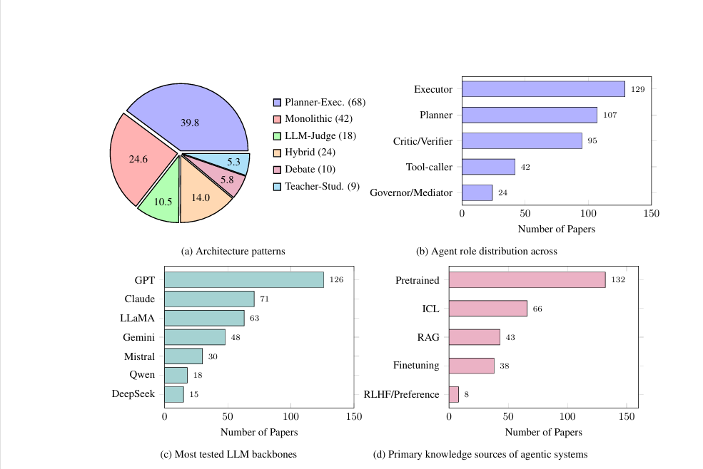

# A Survey on Agentic Security: Applications, Threats, and Defenses

[](https://arxiv.org/abs/2510.06445)
[](https://opensource.org/licenses/MIT)
[](http://makeapullrequest.com)

**Authors:** Asif Shahriar\*, Md Nafiu Rahman\*, Sadif Ahmed\*, Farig Sadeque, Md Rizwan Parvez  
*BRAC University, Qatar Computing Research Institute (QCRI)*

---

## 📖 Overview

The transition from passive LLMs to autonomous **LLM-agents** marks a paradigm shift in cybersecurity. While agents offer powerful capabilities for offensive and defensive operations, they introduce a new class of inherent security risks.

This repository maintains the resources, taxonomy, and paper list associated with our survey: **"A Survey on Agentic Security: Applications, Threats and Defenses"**.

We structure the field around three interdependent pillars:
1.  **Applications:** How agents are used in Red/Blue teaming.
2.  **Threats:** Vulnerabilities inherent to agentic systems (e.g., indirect injection, memory poisoning).
3.  **Defenses:** Countermeasures to harden agentic systems.


*(Figure 1: Overview of the Agentic Security Landscape)*

---

## 🗂️ Taxonomy & Paper List

Below is the classification of the 150+ papers analyzed in our work.

### 🛡️ I. Applications
**Red Teaming (Offensive Security)**
* **Autonomous Penetration Testing:** Agents that perform recon and exploitation (e.g., PentestGPT, HackSynth)
* **Automated Vuln Discovery & Fuzzing:** Reasoning-driven fuzzing (e.g., Locus, ChatAFL).
* **Exploit Generation:** Malware and exploit adaptation (e.g., MalGen, CVE-Genie).

**Blue Teaming (Defensive Security)**
* **Autonomous Threat Detection:** Agentic SOC frameworks (e.g., IRCopilot, CORTEX).
* **Intelligent Threat Hunting:** Hypothesis generation and querying (e.g., ProvSEEK).
* **Automated Forensics:** RCA and log analysis (e.g., RepoAudit, CyberSleuth).
* **Autonomous Patching:** Repair and remediation (e.g., RepairAgent).

**Domain-Specific**
* **Cloud & Infrastructure:** (e.g., KubeIntellect).
* **Web & Application:** (e.g., MAPTA, Progent).
* **Specialized:** Blockchain, Healthcare, Privacy (e.g., LISA, HIPAA-compliant agents).

### ⚠️ II. Threats
**Attack Surface**
* **Injection Attacks:** Direct and Indirect Prompt Injection (e.g., AgentDojo, PromptInfection).
* **Poisoning & Extraction:** Memory corruption and model stealing (e.g., AgentPoison).
* **Jailbreak Attacks:** Bypassing safety guardrails (e.g., BrowserArt, JAWS-BENCH).
* **Agent Manipulation:** Goal hijacking and reward hacking (e.g., PromptInject).
* **Red-Teaming Attacks:** Agent-in-the-Middle and multi-agent adversarial flows.

**Evaluation**
* **Adversarial Benchmarks:** (e.g., AgentHarm, SafeArena, ASB).
* **Execution Environments:** Sandboxes for testing (e.g., DoomArena).

### 🛡️ III. Defenses
**Defense & Operations**
* **Secure-by-Design:** Architecture isolation and permissions (e.g., ACE, Task Shield).
* **Multi-Agent Security:** Trust and collaboration protocols (e.g., D-CIPHER).
* **Runtime Protection:** Monitoring and guardrails (e.g., R-Guard, AgentSpec).
* **Security Operations:** Formal verification and incident response.

**Evaluation**
* **Benchmarking Platforms:** (e.g., RAS-Eval).
* **Defense Testing:** Testing resilience of defenses.

---

## 📊 Key Insights

A cross-cutting analysis of the literature reveals:
* **Architecture:** A shift from monolithic to planner-executor and multi-agent designs.
* **Model Dominance:** A heavy reliance on GPT-4, though open-weight models are rising.
* **Gaps:** RAG poisoning is under-defended, and there is a lack of focus on image/audio modalities in agentic security.



---

## 🤝 Contribution
This is an active research area. If you have a paper that fits into this taxonomy, please:

Fork the repository.

Add your paper to the relevant section in the list.

Submit a Pull Request.

--- 

## 📞 Contact
For inquiries regarding the survey, dataset updates, or collaboration, please contact:

Asif Shahriar 📧 asifshahriar@gmail.com 

---

## 📝 Citation

If you find this survey or repository useful, please cite our work:

```bibtex
@article{shahriar2025agentic,
  title={A Survey on Agentic Security: Applications, Threats and Defenses},
  author={Shahriar, Asif and Rahman, Md Nafiu and Ahmed, Sadif and Sadeque, Farig and Parvez, Md Rizwan},
  journal={arXiv preprint arXiv:2510.06445},
  year={2025}
}

