# Awesome Agentic Security Papers

<p align="center">
  <a href="https://arxiv.org/abs/2510.06445">
    
  </a>
  <a href="https://opensource.org/licenses/MIT">
    
  </a>
  <a href="http://makeapullrequest.com">
    
  </a>
</p>


<p align="center"><strong>A Survey on Agentic Security: Applications, Threats and Defenses
</strong></p>
<p align="center"></p>
<!-- First Part (Original) -->
<p align="center"><strong>Authors:</strong> Asif Shahriar*, Md Nafiu Rahman*, Sadif Ahmed*, Farig Sadeque, Md Rizwan Parvez</p>
<p align="center">BRAC University, Qatar Computing Research Institute (QCRI)</p>

<div align="center">
    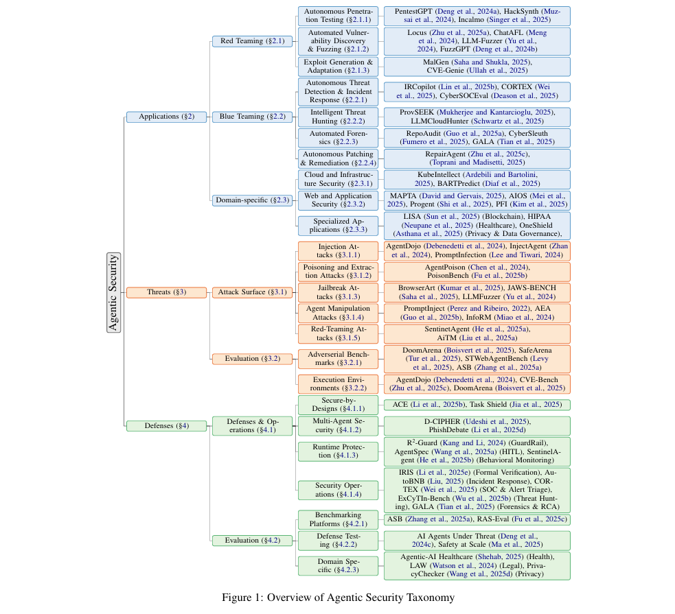
</div>

<hr/>

## Contributing to this paper list

Feel free to **open an issue/PR** or e-mail [asif.asr11@gmail.com](mailto:asif.asr11@gmail.com) if you find any missing areas, papers, or benchmarks. We will keep updating this list and survey.

## Survey Introduction

The move from passive language models to autonomous LLM-agents marks a major shift in cybersecurity. These agents can act on their own. They can help with both attacking and defending systems, yet they also create new risks because they make decisions and interact with the world in more complex ways. This gives attackers more paths to mislead or control them.

This repository gathers the resources, taxonomy, and papers linked to the survey "A Survey on Agentic Security: Applications, Threats and Defenses." The survey offers a clear overview of the security issues that come with autonomous agents. It centers on three questions. What agents can do for security. How agents can be attacked. How they can be protected.

In the survey. we explain the agentic security landscape through three main points:

1. How agents help with offensive and defensive security tasks.

2. Where agents are vulnerable, such as hidden prompts in outside content or harmful data written into memory.

3. How defenders can protect agents so they act safely and reliably.

This overview aims to support more research on agentic security. The goal is to use the strengths of autonomous agents while reducing the risks they bring. This will guide the development of systems that deliver real benefits while keeping harm low.

---

## Table of Contents

* [Survey Introduction](#survey-introduction)
* [Table of Contents](#table-of-contents)
* [Related Surveys](#related-surveys)
* [Papers](#papers)
    * [Applications](#applications)
        * [Red-Teaming](#red-teaming)
          * [Autonomous Penetration Testing](#autonomous-penetration-testing)
          * [Automated Vulnerability Discovery & Fuzzing](#automated-vulnerability-discovery--fuzzing)
          * [Exploit Generation](#exploit-generation)
        * [Blue-Teaming](#blue-teaming)
          * [Autonomous Threat Detection](#autonomous-threat-detection)
          * [Intelligent Threat Hunting](#intelligent-threat-hunting)
          * [Automated Forensics](#automated-forensics)
          * [Autonomous Patching](#autonomous-patching)
        * [Domain-Specific Applications](#domain-specific-applications)
          * [Cloud & Infrastructure Security](#cloud--infrastructure-security)
          * [Web & Application Security](#web--application-security)
          * [Specialized Domains](#specialized-domains)
    * [Threats](#threats)
        * [Attack Surface](#attack-surface)
          * [Injection Attacks](#injection-attacks)
          * [Poisoning & Extraction Attacks](#poisoning--extraction-attacks)
          * [Jailbreak Attacks](#jailbreak-attacks)
          * [Agent Manipulation Attacks](#agent-manipulation-attacks)
          * [Pre-execution Cognitive Attacks](#pre-execution-cognitive-attacks)
          * [Red-Teaming Attacks](#red-teaming-attacks)
        * [Evaluation](#evaluation)
          * [Adversarial Benchmarks](#adversarial-benchmarks)
          * [Execution Environments](#execution-environments)
    * [Defenses](#defenses)
        * [Defense & Operations](#defense--operations)
          * [Secure-by-Design Architectures](#secure-by-design-architectures)
          * [Multi-Agent Security](#multi-agent-security)
          * [Runtime Protection](#runtime-protection)
          * [Security Operations](#security-operations)
        * [Evaluation](#evaluation-1)
          * [Benchmarking Platforms](#benchmarking-platforms)
          * [Defense Testing](#defense-testing)
* [Analysis](#analysis)
    * [Applications Analysis](#applications-analysis)
    * [Threats Analysis](#threats-analysis)
    * [Defenses Analysis](#defenses-analysis)
    * [Cross-Cutting Trends](#cross-cutting-trends)

## Related Surveys

1.  Security of AI Agents: **"Security of AI Agents"**.
    *Yifeng He et al.* arXiv 2024. [[Paper](https://arxiv.org/abs/2406.08689)]

2.  Trustworthy Agents: **"A Survey on Trustworthy LLM Agents: Threats and Countermeasures"**.
    *Miao Yu et al.* KDD 2025. [[Paper](https://dl.acm.org/doi/10.1145/3637528.3671607)]

3.  TRISM: **"TRISM for Agentic AI: A Review of Trust, Risk, and Security Management in LLM-Based Agentic Multi-Agent Systems"**.
    *Shaina Raza et al.* arXiv 2025. [[Paper](https://arxiv.org/abs/2506.04133)]

4.  Agents Under Threat: **"AI Agents Under Threat: A Survey of Key Security Challenges and Future Pathways"**.
    *Zehang Deng et al.* arXiv 2024. [[Paper](https://arxiv.org/abs/2406.02630)]

5.  Safety at Scale: **"Safety at Scale: A Comprehensive Survey of Large Model and Agent Safety"**.
    *Xingjun Ma et al.* Foundations and Trends in Privacy and Security 2025. [[Paper](https://www.nowpublishers.com/article/Details/PSEC-030)]

6.  Multi-Agent Challenges: **"Open Challenges in Multi-Agent Security: Towards Secure Systems of Interacting AI Agents"**.
    *Christian Schroeder de Witt.* arXiv 2025. [[Paper](https://arxiv.org/abs/2505.02077)]

7.  Commercial Vulnerabilities: **"Commercial LLM Agents Are Already Vulnerable to Simple Yet Dangerous Attacks"**.
    *Ang Li et al.* arXiv 2025. [[Paper](https://arxiv.org/abs/2502.08586)]

8.  Agent Communication: **"A Survey of LLM-Driven AI Agent Communication: Protocols, Security Risks, and Defense Countermeasures"**.
    *Dezhang Kong et al.* arXiv 2025. [[Paper](https://arxiv.org/abs/2506.19676)]

9.  Full Stack Safety: **"A Comprehensive Survey in LLM(-Agent) Full Stack Safety: Data, Training and Deployment"**.
    *Kun Wang et al.* arXiv 2025. [[Paper](https://arxiv.org/abs/2504.15585)]

10. Agentic AI Security: **"Agentic AI Security: Threats, Defenses, Evaluation, and Open Challenges"**.
    *Anshuman Chhabra et al.* IEEE Access 2026. [[Paper](https://doi.org/10.1109/ACCESS.2026.3675554)]

## Papers

### Applications

#### Red-Teaming

##### Autonomous Penetration Testing

1.  PentestGPT: **"PentestGPT: An LLM-empowered Automatic Penetration Testing Tool"**.
    *Gelei Deng et al.* USENIX Security 2024. [[Paper](https://www.usenix.org/system/files/usenixsecurity24-deng.pdf)][[GitHub](https://github.com/GreyDGL/PentestGPT)]

2.  PentestAgent: **"PentestAgent: Incorporating LLM Agents to Automated Penetration Testing"**.
    *Xiangmin Shen et al.* ASIA CCS 2025. [[Paper](https://dl.acm.org/doi/10.1145/3708821.3733882)][[GitHub](https://github.com/nbshenxm/pentest-agent)]

3.  Vulnbot: **"VulnBot: Autonomous Penetration Testing for A Multi-Agent Collaborative Framework"**.
    *He Kong et al.* arXiv 2025. [[Paper](https://arxiv.org/abs/2501.13411)][[GitHub](https://github.com/KHenryAegis/VulnBot)]

4.  Aracne: **"Aracne: An LLM-based Autonomous Shell Pentesting Agent"**.
    *Tomas Nieponice et al.* arXiv 2025. [[Paper](https://arxiv.org/abs/2502.18528)][[Github](https://github.com/stratosphereips/aracne)]

5.  Cochise: **"Can LLMs Hack Enterprise Networks? Autonomous Assumed Breach Penetration-Testing Active Directory Networks"**.
    *Andreas Happe and Jürgen Cito.* ACM Trans. Softw. Eng. Methodol. 2025. [[Paper](https://dl.acm.org/doi/10.1145/3766895)][[GitHub](https://github.com/andreashappe/cochise)]

6.  RedTeamLLM: **"RedTeamLLM: An Agentic AI Framework for Offensive Security"**.
    *Brian Challita and Pierre Parrend.* arXiv 2025. [[Paper](https://arxiv.org/abs/2505.06913)][[GitHub](https://github.com/lre-security-systems-team/redteamllm)]

7.  Co-RedTeam: **"Co-RedTeam: Orchestrated Security Discovery and Exploitation with LLM Agents"**.
    *Pengfei He et al.* arXiv 2026. [[Paper](https://arxiv.org/abs/2602.02164)]

8.  CAI: **"CAI: An Open, Bug Bounty-Ready Cybersecurity AI"**.
    *Víctor Mayoral-Vilches et al.* arXiv 2025. [[Paper](https://arxiv.org/abs/2504.06017)][[GIthub](https://github.com/aliasrobotics/cai)]

9.  RapidPen: **"RapidPen: Fully Automated IP-to-Shell Penetration Testing with LLM-based Agents"**.
    *Sho Nakatani.* arXiv 2026. [[Paper](https://arxiv.org/abs/2502.16730)]

10. AutoPentester: **"AutoPentester: An LLM Agent-based Framework for Automated Pentesting"**.
    *Yasod Ginige et al.* TrustCom 2025. [[Paper](https://doi.org/10.1109/Trustcom66490.2025.00026)][[Github](https://github.com/YasodGinige/AutoPentester)]

11. PenHeal: **"PenHeal: A Two-Stage LLM Framework for Automated Pentesting and Optimal Remediation"**.
    *Junjie Huang and Quanyan Zhu.* AutonomousCyber 2024. [[Paper](https://doi.org/10.1145/3689933.3690831)]

12. Enhancing Linux Privilege Escalation: **"Enhancing Linux Privilege Escalation Attack Capabilities of Local LLM Agents"**.
    *Benjamin Probst et al.* arXiv 2026. [[Paper](https://arxiv.org/abs/2604.27143)]

13. HackSynth: **"Hacksynth: LLM Agent and Evaluation Framework for Autonomous Penetration Testing"**.
    *Lajos Muzsai et al.* arXiv 2024. [[Paper](https://arxiv.org/abs/2412.01778)][[Github](https://github.com/aielte-research/HackSynth)]

14. AutoPentest: **"AutoPentest: Enhancing Vulnerability Management with Autonomous LLM Agents"**.
    *Julius Henke.* arXiv 2025. [[Paper](https://arxiv.org/abs/2505.10321)][[Github](https://github.com/JuliusHenke/autopentest)]

15. LLM-Pentest-Efficacy: **"On the Surprising Efficacy of LLMs for Penetration-Testing"**.
    *Andreas Happe and Jürgen Cito.* arXiv 2025. [[Paper](https://arxiv.org/abs/2507.00829)]

16. From-Capabilities-to-Performance: **"From Capabilities to Performance: Evaluating Key Functional Properties of LLM Architectures in Penetration Testing"**.
    *Huang et al.* EMNLP 2025. [[Paper](https://aclanthology.org/2025.emnlp-main.802/)]

17. What-Makes-Good-Agent: **"What Makes a Good LLM Agent for Real-world Penetration Testing?"**.
    *Gelei Deng et al.* arXiv 2026. [[Paper](https://arxiv.org/abs/2602.17622)]

18. Incalmo: **"Incalmo: An Autonomous LLM-assisted System for Red Teaming Multi-Host Networks"**.
    *Brian Singer et al.* arXiv 2025. [[Paper](https://arxiv.org/abs/2501.16466)][[Github](https://github.com/bsinger98/Incalmo)]

19. xOffense: **"xOffense: An AI-Driven Autonomous Penetration Testing Framework with Offensive Knowledge-Enhanced LLMs and Multi Agent Systems"**.
    *Phung Duc Luong et al.* arXiv 2025. [[Paper](https://arxiv.org/abs/2509.13021)]

20. ARTEMIS: **"Comparing AI Agents to Cybersecurity Professionals in Real-World Penetration Testing"**.
    *Justin W. Lin et al.* arXiv 2026. [[Paper](https://arxiv.org/abs/2512.09882)][[Github](https://github.com/Stanford-Trinity/ARTEMIS)]

21. AutoPenBench: **"AutoPenBench: Benchmarking Generative Agents for Penetration Testing"**.
    *Luca Gioacchini et al.* arXiv 2024. [[Paper](https://arxiv.org/abs/2410.03225)][[Github](https://github.com/lucagioacchini/auto-pen-bench)]

22. AI-Pentest-Benchmark: **"Towards automated penetration testing: Introducing LLM Benchmark, Analysis, and Improvements"**.
    *Isamu Isozaki et al.* arXiv 2024. [[Paper](https://arxiv.org/abs/2410.17141)][[Github](https://github.com/isamu-isozaki/AI-Pentest-Benchmark)]

23. Cybench: **"Cybench: A Framework for Evaluating Cybersecurity Capabilities and Risks of Language Models"**.
    *Andy K Zhang et al.* ICLR 2025. [[Paper](https://openreview.net/forum?id=tc90LV0yRL)][[Github](https://github.com/andyzorigin/cybench)]

24. BountyBench: **"BountyBench: Dollar Impact of AI Agent Attackers and Defenders on Real-World Cybersecurity Systems"**.
    *Andy K Zhang et al.* NeurIPS 2026. [[Paper](https://openreview.net/forum?id=pIsP4lMlFd)] [[GitHub](https://github.com/bountybench/bountybench)]

25. EnIGMA: **"EnIGMA: Interactive Tools Substantially Assist LM Agents in Finding Security Vulnerabilities"**.
    *Talor Abramovich et al.* ICML 2025. [[Paper](https://openreview.net/forum?id=Of3wZhVv1R)] [[GitHub](https://github.com/SWE-agent/SWE-agent)]

26. CTFAgent: **"CTFAgent: An LLM-powered Agent for CTF Challenge Solving"**.
    *Yuwen Zou et al.* JISA 2026. [[Paper](https://www.sciencedirect.com/science/article/pii/S2214212625003424)]

27. CTF-Dojo: **"Training Language Model Agents to Find Vulnerabilities with CTF-Dojo"**.
    *Terry Yue Zhuo et al.* NeurIPS Workshop 2025. [[Paper](https://openreview.net/forum?id=sQPeclxRBG)][[Github](https://github.com/amazon-science/CTF-Dojo)]

28. Cyber-Zero: **"Cyber-Zero: Training Cybersecurity Agents without Runtime"**.
    *Terry Yue Zhuo et al.* ICLR 2026. [[Paper](https://openreview.net/forum?id=1gRTeAik4G)][[Github](https://github.com/amazon-science/Cyber-Zero)]

##### Automated Vulnerability Discovery & Fuzzing

1.  Locus: **"Locus: Agentic Predicate Synthesis for Directed Fuzzing"**.
    *Jie Zhu et al.* arXiv 2025. [[Paper](https://arxiv.org/abs/2508.21302)][[Github](https://github.com/jiezhuzzz/Locus)]

2.  ChatAFL: **"Large Language Model Guided Protocol Fuzzing"**.
    *Ruijie Meng et al.* NDSS 2024. [[Paper](https://www.ndss-symposium.org/ndss-paper/large-language-model-guided-protocol-fuzzing/)][[Github](https://github.com/ChatAFLndss/ChatAFL)]

3.  FirmAgent: **"FirmAgent: Leveraging Fuzzing to Assist LLM Agents with IoT Firmware Vulnerability Discovery"**.
    *Jiangan Ji et al.* NDSS 2026. [[Paper](https://www.ndss-symposium.org/ndss-paper/firmagent-leveraging-fuzzing-to-assist-llm-agents-with-iot-firmware-vulnerability-discovery/)]

4.  ChainFuzzer: **"ChainFuzzer: Greybox Fuzzing for Workflow-Level Multi-Tool Vulnerabilities in LLM Agents"**.
    *Jiangrong Wu et al.* arXiv 2026. [[Paper](https://arxiv.org/abs/2603.12614)]

5.  One-Day-Exploits: **"LLM Agents Can Autonomously Exploit One-Day Vulnerabilities"**.
    *Richard Fang et al.* arXiv 2024. [[Paper](https://arxiv.org/abs/2404.08144)]

6.  Zero-Day-Exploits: **"Teams of LLM Agents Can Exploit Zero-Day Vulnerabilities"**.
    *Yuxuan Zhu et al.* arXiv 2025. [[Paper](https://arxiv.org/abs/2406.01637)]

7.  A2: **"Agentic Discovery and Validation of Android App Vulnerabilities"**.
    *Ziyue Wang and Liyi Zhou.* arXiv 2025. [[Paper](https://arxiv.org/abs/2508.21579)]

8.  TTPDetect: **"Identifying Adversary Tactics and Techniques in Malware Binaries with an LLM Agent"**.
    *Zhou Xuan et al.* arXiv 2026. [[Paper](https://arxiv.org/abs/2602.06325)]

9.  Sec-Bench: **"Sec-bench: Automated Benchmarking of LLM Agents on Real-World Software Security Tasks"**.
    *Hwiwon Lee et al.* arXiv 2025. [[Paper](https://arxiv.org/abs/2506.11791)][[Github](https://github.com/SEC-bench/SEC-bench)]

10. CVE-Bench (Web): **"CVE-Bench: A Benchmark for AI Agents' Ability to Exploit Real-World Web Application Vulnerabilities"**.
    *Yuxuan Zhu et al.* arXiv 2025. [[Paper](https://arxiv.org/abs/2503.17332)][[Github](https://github.com/uiuc-kang-lab/cve-bench)]

11. CVE-bench (Repair): **"CVE-bench: Benchmarking LLM-based Software Engineering Agent's Ability to Repair Real-World CVE Vulnerabilities"**.
    *Peiran Wang et al.* NAACL 2025. [[Paper](https://aclanthology.org/2025.naacl-long.212/)]

12. ExCyTInBench: **"Excytin-bench: Evaluating LLM Agents on Cyber Threat Investigation"**.
    *Yiran Wu et al.* arXiv 2025. [[Paper](https://arxiv.org/abs/2507.14201)][[Github](https://github.com/kaebvcidn/Excytin-Bench)]

13. CyberGym: **"CyberGym: Evaluating AI Agents' Real-World Cybersecurity Capabilities at Scale"**.
    *Zhun Wang et al.* ICLR 2026. [[Paper](https://openreview.net/forum?id=2YvbLQEdYt)][[Github](https://github.com/sunblaze-ucb/cybergym)][[HuggingFace](https://huggingface.co/datasets/sunblaze-ucb/cybergym)]

14. ZeroDayBench: **"ZeroDayBench: Evaluating LLM Agents on Unseen Zero-Day Vulnerabilities for Cyberdefense"**.
    *Nancy Lau et al.* arXiv 2026. [[Paper](https://arxiv.org/abs/2603.02297)]

15. SecRepoBench: **"SecRepoBench: Benchmarking Code Agents for Secure Code Completion in Real-World Repositories"**.
    *Chihao Shen et al.* arXiv 2026. [[Paper](https://arxiv.org/abs/2504.21205)]

16. SecVulEval: **"SecVulEval: Benchmarking LLMs for Real-World C/C++ Vulnerability Detection"**.
    *Md Basim Uddin Ahmed et al.* arXiv 2025. [[Paper](https://arxiv.org/abs/2505.19828)] [[GitHub](https://github.com/basimbd/SecVulEval)]

17. JIT-Vuln-Detection: **"Benchmarking LLMs and LLM-based Agents in Practical Vulnerability Detection for Code Repositories"**.
    *Alperen Yildiz et al.* ACL 2025. [[Paper](https://aclanthology.org/2025.acl-long.1490/)][[Github](https://github.com/alperen21/JitVul)]

18. CWEval: **"CWEval: Outcome-driven Evaluation on Functionality and Security of LLM Code Generation"**.
    *Jinjun Peng et al.* arXiv 2025. [[Paper](https://arxiv.org/abs/2501.08200)] [[GitHub](https://github.com/Co1lin/CWEval)]

19. LLM-Fuzzer: **"LLM-Fuzzer: Scaling Assessment of Large Language Model Jailbreaks"**.
    *Jiahao Yu et al.* USENIX Security 2024. [[Paper](https://www.usenix.org/system/files/usenixsecurity24-yu-jiahao.pdf)][[Github](https://github.com/sherdencooper/GPTFuzz)]

20. TitanFuzz: **"Large Language Models Are Zero-Shot Fuzzers: Fuzzing Deep-Learning Libraries via Large Language Models"**.
    *Yinlin Deng et al.* ISSTA 2023. [[Paper](https://dl.acm.org/doi/10.1145/3597926.3598067)][[Github](https://github.com/ise-uiuc/TitanFuzz)]

21. FuzzGPT: **"Large Language Models Are Edge-Case Generators: Crafting Unusual Programs for Fuzzing Deep Learning Libraries"**.
    *Yinlin Deng et al.* ICSE 2024. [[Paper](https://dl.acm.org/doi/10.1145/3597503.3623343)][[Github](https://github.com/ise-uiuc/FuzzGPT)]

##### Exploit Generation

1.  Dark-Side-Agents: **"The Dark Side of LLMs: Agent-Based Attacks for Complete Computer Takeover"**.
    *Matteo Lupinacci et al.* arXiv 2025. [[Paper](https://arxiv.org/abs/2507.06850)]

2.  MalGen: **"MalGen: A Generative Agent Framework for Modeling Malicious Software in Cybersecurity"**.
    *Bikash Saha and Sandeep Kumar Shukla.* arXiv 2025. [[Paper](https://arxiv.org/abs/2506.07586)]

3.  AiTM: **"Red-Teaming LLM Multi-Agent Systems via Communication Attacks"**.
    *Pengfei He et al.* ACL 2025. [[Paper](https://aclanthology.org/2025.findings-acl.349/)][[Github](https://github.com/PengfeiHePower/AiTM)]

4.  AttackLLM: **"AttackLLM: LLM-based Attack Pattern Generation for an Industrial Control System"**.
    *Chuadhry Mujeeb Ahmed.* FMSys 2025. [[Paper](https://doi.org/10.1145/3722565.3727196)]

5.  CVE-Genie: **"From CVE Entries to Verifiable Exploits: An Automated Multi-Agent Framework for Reproducing CVEs"**.
    *Saad Ullah et al.* arXiv 2025. [[Paper](https://arxiv.org/abs/2509.01835)][[Github](https://github.com/MaKyOtOx/cve-genie-prompts)]

6.  ReX: **"Prompt to Pwn: Automated Exploit Generation for Smart Contracts"**.
    *ZeKe Xiao et al.* arXiv 2026. [[Paper](https://arxiv.org/abs/2508.01371)][[Github](https://github.com/Crimson798/AEG-PoC)]

7.  VulnSage: **"A Multi-Agent Framework for Automated Exploit Generation with Constraint-Guided Comprehension and Reflection"**.
    *Siyi Chen et al.* arXiv 2026. [[Paper](https://arxiv.org/abs/2604.05130)][[Github](https://github.com/Vulnsage/VulnSage)]

8.  Smart-Contract-Exploit: **"AI Agent Smart Contract Exploit Generation"**.
    *Arthur Gervais and Liyi Zhou.* arXiv 2026. [[Paper](https://arxiv.org/abs/2507.05558)]

9.  LLM4CVE: **"LLM4CVE: Enabling Iterative Automated Vulnerability Repair with Large Language Models"**.
    *Mohamad Fakih et al.* arXiv 2025. [[Paper](https://arxiv.org/abs/2501.03446)][[Link](https://sites.google.com/view/llm4cve)]

#### Blue-Teaming

##### Autonomous Threat Detection

1.  AACT: **"Automated Alert Classification and Triage (AACT): An Intelligent System for the Prioritisation of Cybersecurity Alerts"**.
    *Melissa Turcotte et al.* arXiv 2025. [[Paper](https://arxiv.org/abs/2505.09843)]

2.  RAG-Incident-Response: **"Advancing Autonomous Incident Response: Leveraging LLMs and Cyber Threat Intelligence"**.
    *Amine Tellache et al.* arXiv 2025. [[Paper](https://arxiv.org/abs/2508.10677)]

3.  CyberRAG: **"CyberRAG: An Agentic RAG Cyber Attack Classification and Reporting Tool"**.
    *Francesco Blefari et al.* Future Generation Computer Systems 2026. [[Paper](https://doi.org/10.1016/j.future.2025.108186)]

4.  IRCopilot: **"IRCopilot: Automated Incident Response with Large Language Models"**.
    *Xihuan Lin et al.* arXiv 2025. [[Paper](https://arxiv.org/abs/2505.20945)][[Code](https://anonymous.4open.science/r/IRCopilot-78A0)]

5.  CORTEX: **"Cortex: Collaborative LLM Agents for High-Stakes Alert Triage"**.
    *Bowen Wei et al.* arXiv 2025. [[Paper](https://arxiv.org/abs/2510.00311)]

6.  IDS-Agent: **"IDS-Agent: An LLM Agent for Explainable Intrusion Detection in IoT Networks"**.
    *Yanjie Li et al.* NeurIPS Workshop 2024. [[Paper](https://openreview.net/forum?id=iiK0pRyLkw)]

7.  AutoBnB: **"AutoBnB: Multi-Agent Incident Response with Large Language Models"**.
    *Zefang Liu.* ISDFS 2025. [[Paper](https://ieeexplore.ieee.org/document/11012055)][[Github](https://github.com/zefang-liu/AutoBnB)]

8.  In-Context-Incident-Response: **"In-Context Autonomous Network Incident Response: An End-to-End Large Language Model Agent Approach"**.
    *Yiran Gao et al.* arXiv 2026. [[Paper](https://arxiv.org/abs/2602.13156)]

9.  LLM-in-the-SOC-Empirical-Study: **"LLMs in the SOC: An Empirical Study of Human-AI Collaboration in Security Operations Centres"**.
    *Ronal Singh et al.* arXiv 2025. [[Paper](https://arxiv.org/abs/2508.18947)][[Github](https://github.com/eSentire-Labs/LLM-Gateway)]

10. CyberSOCEval: **"CyberSOCEval: Benchmarking LLMs Capabilities for Malware Analysis and Threat Intelligence Reasoning"**.
    *Lauren Deason et al.* arXiv 2025. [[Paper](https://arxiv.org/abs/2509.20166)][[Data](https://github.com/CrowdStrike/CyberSOCEval_data)][[Github](https://github.com/meta-llama/PurpleLlama)]

11. CTI-REALM: **"CTI-REALM: Benchmark to Evaluate Agent Performance on Security Detection Rule Generation Capabilities"**.
    *Arjun Chakraborty et al.* arXiv 2026. [[Paper](https://arxiv.org/abs/2603.13517)]

12. Log-Analysis-Survey: **"Automated Threat Detection and Response Using LLM Agents"**.
    *Ramasankar Molleti et al.* World Journal of Advanced Research and Reviews 2024. [[Paper](https://wjarr.com/sites/default/files/WJARR-2024-3329.pdf)]

##### Intelligent Threat Hunting

1.  LLM-Automate-Threat: **"Using LLMs to Automate Threat Intelligence Analysis Workflows in Security Operation Centers"**.
    *PeiYu Tseng et al.* arXiv 2024. [[Paper](https://arxiv.org/abs/2407.13093)]

2.  ProvSEEK: **"LLM-Driven Provenance Forensics for Threat Investigation and Detection"**.
    *Kunal Mukherjee and Murat Kantarcioglu.* arXiv 2025. [[Paper](https://arxiv.org/abs/2508.21323)][[Github](https://anonymous.4open.science/r/provseek-anonymous-DDDD)]

3.  CTI-Vulnerabilities: **"Uncovering Vulnerabilities of LLM-Assisted Cyber Threat Intelligence"**.
    *Yuqiao Meng et al.* arXiv 2025. [[Paper](https://arxiv.org/abs/2509.23573)][[Github](https://github.com/mengyuqiao/LLM-CTI)]

4.  LLMCloudHunter: **"LLMCloudHunter: Harnessing LLMs for Automated Extraction of Detection Rules from Cloud-Based CTI"**.
    *Yuval Schwartz et al.* WWW 2025. [[Paper](https://dl.acm.org/doi/10.1145/3696410.3714798)][[Github](https://github.com/YuvalSchwartz/llm-cloud-hunter)]

5.  Security-Logs-ATT&CK: **"Security Logs to ATT&CK Insights: Leveraging LLMs for High-Level Threat Understanding and Cognitive Trait Inference"**.
    *Soham Hans et al.* arXiv 2025. [[Paper](https://arxiv.org/abs/2510.20930)]

6.  Cyber-Defense-Benchmark: **"Cyber Defense Benchmark: Agentic Threat Hunting Evaluation for LLMs in SecOps"**.
    *Alankrit Chona et al.* arXiv 2026. [[Paper](https://arxiv.org/abs/2604.19533)][[Github](https://github.com/simbianai/cyber_defense_benchmark)]

##### Automated Forensics

1.  RepoAudit: **"RepoAudit: An Autonomous LLM-Agent for Repository-Level Code Auditing"**.
    *Jinyao Guo et al.* ICML 2025. [[Paper](https://openreview.net/pdf?id=TXcifVbFpG)][[Github](https://github.com/PurCL/RepoAudit)]

2.  LLM-Cloud-Forensics: **"LLM-Powered Automated Cloud Forensics: From Log Analysis to Investigation"**.
    *Dalal Alharthi and Rozhin Yasaei.* IEEE CLOUD 2025. [[Paper](https://ieeexplore.ieee.org/document/11120597)]

3.  CyberSleuth: **"CyberSleuth: Autonomous Blue-Team LLM Agent for Web Attack Forensics"**.
    *Stefano Fumero et al.* arXiv 2025. [[Paper](https://arxiv.org/abs/2508.20643)][[Github](https://github.com/SmartData-Polito/LLM_Agent_Cybersecurity_Forensic)]

4.  GALA: **"GALA: Can Graph-Augmented Large Language Model Agentic Workflows Elevate Root Cause Analysis?"**.
    *Yifang Tian et al.* arXiv 2025. [[Paper](https://arxiv.org/abs/2508.12472)]

5.  MAST: **"Why Do Multiagent Systems Fail?"**.
    *Melissa Z Pan et al.* ICLR Workshop 2025. [[Paper](https://openreview.net/pdf?id=wM521FqPvI)][[Github](https://github.com/multi-agent-systems-failure-taxonomy/MAST)]

6.  CIAF: **"Cloud Investigation Automation Framework (CIAF): An AI-Driven Approach to Cloud Forensics"**.
    *Dalal Alharthi and Ivan Roberto Kawaminami Garcia.* arXiv 2025. [[Paper](https://arxiv.org/abs/2510.00452)]

7.  ReCopilot: **"ReCopilot: Reverse Engineering Copilot in Binary Analysis"**.
    *Guoqiang Chen et al.* arXiv 2025. [[Paper](https://arxiv.org/abs/2505.16366)]

8.  MalParse: **"Exploring Large Language Models for Semantic Analysis and Categorization of Android Malware"**.
    *Brandon J Walton et al.* ACSAC Workshops 2024. [[Paper](https://doi.ieeecomputersociety.org/10.1109/ACSACW65225.2024.00035)]

##### Autonomous Patching

1.  CVE-Bench (Repair): **"CVE-Bench: A Benchmark for AI Agents' Ability to Exploit Real-World Web Application Vulnerabilities"**.
    *Yuxuan Zhu et al.* ICML 2025. [[Paper](https://openreview.net/pdf?id=3pk0p4NGmQ)][[Github](https://github.com/uiuc-kang-lab/cve-bench)]

2.  RepairAgent: **"RepairAgent: An Autonomous, LLM-Based Agent for Program Repair"**.
    *Islem Bouzenia et al.* ICSE 2025. [[Paper](https://dl.acm.org/doi/10.1109/ICSE55347.2025.00157)][[Github](https://github.com/sola-st/RepairAgent)]

3.  Gemini-Patching: **"AI-Powered Patching: The Future of Automated Vulnerability Fixes"**.
    *Jan Keller and Jan Nowakowski.* Technical Report 2024. [[Link](https://research.google/pubs/ai-powered-patching-the-future-of-automated-vulnerability-fixes/)]

4.  IaC-Remediation: **"LLM Agentic Workflow for Automated Vulnerability Detection and Remediation in Infrastructure-as-Code"**.
    *Dheer Toprani and Vijay K. Madisetti.* IEEE Access 2025. [[Paper](https://ieeexplore.ieee.org/document/10965635)]

5.  VulnRepairEval: **"VulnRepairEval: An Exploit-Based Evaluation Framework for Assessing Large Language Model Vulnerability Repair Capabilities"**.
    *Weizhe Wang et al.* arXiv 2025. [[Paper](https://arxiv.org/abs/2509.03331)]

6.  PatchEval: **"PatchEval: A New Benchmark for Evaluating LLMs on Patching Real-World Vulnerabilities"**.
    *Zichao Wei et al.* arXiv 2025. [[Paper](https://arxiv.org/abs/2511.11019)] [[GitHub](https://github.com/bytedance/PatchEval)]

7.  Red-Teaming-Repair: **"Red Teaming Program Repair Agents: When Correct Patches Can Hide Vulnerabilities"**.
    *Simin Chen et al.* arXiv 2025. [[Paper](https://arxiv.org/abs/2509.25894)][[Github](https://github.com/HeyixInn/SWExploit/tree/main)]

#### Domain-Specific Applications

##### Cloud & Infrastructure Security

1.  Cloud-Infrastructure-AI-Agent: **"Cloud Infrastructure Management in the Age of AI Agents"**.
    *Zhenning Yang et al.* ACM SIGOPS Operating Systems Review 2025. [[Paper](https://dl.acm.org/doi/10.1145/3759441.3759443)]

2.  KubeIntellect: **"KubeIntellect: A Modular LLM-Orchestrated Agent Framework for End-to-End Kubernetes Management"**.
    *Mohsen Seyedkazemi Ardebili and Andrea Bartolini.* 2025. [[Paper](https://arxiv.org/abs/2509.02449)][[Github](https://github.com/MSKazemi/KubeIntellect)]

3.  LLMSecConfig: **"LLMSecConfig: An LLM-Based Approach for Fixing Software Container Misconfigurations"**.
    *Ziyang Ye et al.* 2025. [[Paper](https://www.computer.org/csdl/proceedings-article/msr/2025/018300a629/27vTruUNcXe)]

4.  BARTPredict: **"BARTPredict: Empowering IoT Security with LLM-Driven Cyber Threat Prediction"**.
    *Alaeddine Diaf et al.* 2025. [[Paper](https://ieeexplore.ieee.org/document/10901770)]

5.  IaC-Remediation: **"LLM Agentic Workflow for Automated Vulnerability Detection and Remediation in Infrastructure-as-Code"**.
    *Dheer Toprani and Vijay K. Madisetti.* IEEE Access 2025. [[Paper](https://ieeexplore.ieee.org/document/10965635)]

6.  IoT-Edge-Attack-Surface: **"Systems-Level Attack Surface of Edge Agent Deployments on IoT"**.
    *Zhonghao Zhan et al.* EuroMLSys 2026. [[Paper](https://doi.org/10.1145/3805621.3807636)]

##### Web & Application Security

1.  MAPTA: **"Multi-Agent Penetration Testing AI for the Web"**.
    *Isaac David and Arthur Gervais.* 2025. [[Paper](https://arxiv.org/abs/2508.20816)][[Github](https://github.com/arthurgervais/mapta)]

2.  PTFusion: **"PTFusion: LLM-driven Context-Aware Knowledge Fusion for Web Penetration Testing"**.
    *Wenhao Wang et al.* Information Fusion 2026. [[Paper](https://www.sciencedirect.com/science/article/pii/S1566253525007936)]

3.  LLM-Agents-Automated-Web: **"LLM Agents for Automated Web Vulnerability Reproduction: Are We There Yet?"**.
    *Bin Liu et al.* arXiv 2025. [[Paper](https://arxiv.org/abs/2510.14700)]

4.  Browsing-Dangers: **"The Hidden Dangers of Browsing AI Agents"**.
    *Mykyta Mudryi et al.* 2025. [[Paper](https://arxiv.org/abs/2505.13076)][[GIthub](https://github.com/arimlabs/agent-hijacking-poc)]

5.  Prompt-to-SQL: **"Prompt-to-SQL Injections in LLM-Integrated Web Applications: Risks and Defenses"**.
    *Rodrigo Pedro et al.* ICSE 2025. [[Paper](https://doi.org/10.1109/ICSE55347.2025.00007)]

6.  AIOS: **"AIOS: LLM Agent Operating System"**.
    *Kai Mei et al.* Conference on Language Modeling 2025. [[Paper](https://openreview.net/pdf?id=L4HHkCDz2x)][[Github](https://github.com/agiresearch/AIOS)]

7.  Securing-AI-Agents-Like-OS: **"Toward Securing AI Agents Like Operating Systems"**.
    *Lukas Pirch et al.* arXiv 2026. [[Paper](https://arxiv.org/abs/2605.14932)]

8.  OpenClaw-Security: **"A Security Analysis of the OpenClaw AI Agent Framework"**.
    *Surada Suwansathit et al.* arXiv 2026. [[Paper](https://arxiv.org/abs/2603.27517)] [[GitHub](https://github.com/openclaw/openclaw)]

9.  AgentAudit: **"Agent Audit: A Security Analysis System for LLM Agent Applications"**.
    *Haiyue Zhang et al.* arXiv 2026. [[Paper](https://arxiv.org/abs/2603.22853)][[Github](https://github.com/HeadyZhang/agent-audit)]

10. OS-Agents-Survey: **"OS Agents: A Survey on MLLM-based Agents for Computer, Phone and Browser Use"**.
    *Xueyu Hu et al.* 2025. [[Paper](https://aclanthology.org/2025.acl-long.369/)][[Github](https://github.com/OS-Agent-Survey/OS-Agent-Survey)]

11. Prompt-Flow-Integrity: **"Prompt Flow Integrity to Prevent Privilege Escalation in LLM Agents"**.
    *Juhee Kim et al.* 2025. [[Paper](https://arxiv.org/abs/2503.15547)][[Github](https://github.com/compsec-snu/pfi)]

12. Progent: **"Progent: Programmable Privilege Control for LLM Agents"**.
    *Tianneng Shi et al.* 2025. [[Paper](https://arxiv.org/abs/2504.11703)][[Github](https://github.com/sunblaze-ucb/progent)]

##### Specialized Domains

1.  LLM-SmartAudit: **"Advanced Smart Contract Vulnerability Detection via LLM-Powered Multi-Agent Systems"**.
    *Zhiyuan Wei et al.* IEEE TSE 2025. [[Paper](https://ieeexplore.ieee.org/document/11019687)]

2.  LISA: **"LISA Technical Report: An Agentic Framework for Smart Contract Auditing"**.
    *Izaiah Sun et al.* 2025. [[Paper](https://arxiv.org/abs/2509.24698)][[Github](https://github.com/agentlisa)]

3.  SmartLLM: **"SmartLLM: Smart Contract Auditing Using Custom Generative AI"**.
    *Jun Kevin and Pujianto Yugopuspito.* 2025. [[Paper](https://ieeexplore.ieee.org/document/11019687)]

4.  FineTuning-Auditing: **"Combining Fine-Tuning and LLM-Based Agents for Intuitive Smart Contract Auditing with Justifications"**.
    *Wei Ma et al.* 2024. [[Paper](https://dl.acm.org/doi/10.1109/ICSE55347.2025.00027)]

5.  AuditGPT: **"AuditGPT: Auditing Smart Contracts with ChatGPT"**.
    *Shihao Xia et al.* 2024. [[Paper](http://arxiv.org/abs/2404.04306)][[Github](https://github.com/pratraut/auditgpt)]

6.  ReCopilot: **"ReCopilot: Reverse Engineering Copilot in Binary Analysis"**.
    *Guoqiang Chen et al.* arXiv 2025. [[Paper](https://arxiv.org/abs/2505.16366)]

7.  MalParse: **"Exploring Large Language Models for Semantic Analysis and Categorization of Android Malware"**.
    *Brandon J Walton et al.* ACSAC Workshops 2024. [[Paper](https://doi.ieeecomputersociety.org/10.1109/ACSACW65225.2024.00035)]

8.  OT-Deception: **"Network and Device Level Cyber Deception for Contested Environments Using RL and LLMs"**.
    *Abhijeet Sahu et al.* arXiv 2026. [[Paper](https://arxiv.org/abs/2603.17272)]

9.  HIPAA-Agent: **"Towards a HIPAA Compliant Agentic AI System in Healthcare"**.
    *Subash Neupane et al.* 2025. [[Paper](https://arxiv.org/abs/2504.17669)]

10. LLM-Privacy-GuardRails: **"Deploying Privacy Guardrails for LLMs: A Comparative Analysis of Real-World Applications"**.
    *Shubhi Asthana et al.* 2025. [[Paper](https://arxiv.org/abs/2501.12456)]

11. Embodied-AI-Security: **"Towards Robust and Secure Embodied AI: A Survey on Vulnerabilities and Attacks"**.
    *Wenpeng Xing et al.* 2025. [[Paper](https://arxiv.org/abs/2502.13175)]

12. Privacy-Preserving-Medical-Imaging: **"Privacy-Preserving AI for Encrypted Medical Imaging: A Framework for Secure Diagnosis and Learning"**.
    *Abdullah Al Siam and Sadequzzaman Shohan.* arXiv 2025. [[Paper](https://arxiv.org/abs/2507.21060)]

13. Agentic-AI-Healthcare: **"Agentic-AI Healthcare: Multilingual, Privacy-First Framework with MCP Agents"**.
    *Mohammad A. Shehab.* arXiv 2025. [[Paper](https://arxiv.org/abs/2510.02325)]

14. Autonomous-Driving-Perception: **"Enhancing LLM-based Autonomous Driving Agents to Mitigate Perception Attacks"**.
    *Ruoyu Muller et al.* arXiv 2024. [[Paper](https://arxiv.org/abs/2409.14488)]

### Threats

#### Attack Surface

##### Injection Attacks

1.  Polymorphic Prompt: **"To Protect the LLM Agent Against the Prompt Injection Attack with Polymorphic Prompt"**.
    *Zhilong Wang et al.* arXiv 2025. [[Paper](https://arxiv.org/abs/2506.05739)][[Github](https://github.com/zhilongwang/LLMAgentProtector)]

2.  AgentDojo: **"AgentDojo: A Dynamic Environment to Evaluate Prompt Injection Attacks and Defenses for LLM Agents"**.
    *Edoardo Debenedetti et al.* NeurIPS 2024. [[Paper](https://arxiv.org/abs/2406.13352)][[Github](https://github.com/ethz-spylab/agentdojo)]

3.  App-Injection: **"Prompt Injection Attack Against LLM-Integrated Applications"**.
    *Yi Liu et al.* arXiv 2024. [[Paper](https://arxiv.org/abs/2306.05499)][[Github](https://github.com/LLMSecurity/HouYi)]

4.  ToolHijacker: **"Prompt Injection Attack to Tool Selection in LLM Agents"**.
    *Jiawen Shi et al.* NDSS 2026. [[Paper](https://dx.doi.org/10.14722/ndss.2026.230675)]

5.  Imprompter: **"Imprompter: Tricking LLM Agents into Improper Tool Use"**.
    *Xiaohan Fu et al.* arXiv 2024. [[Paper](https://arxiv.org/abs/2410.14923)] [[GitHub](https://github.com/Reapor-Yurnero/imprompter)]

6.  WebInject: **"WebInject: Prompt Injection Attack to Web Agents"**.
    *Xilong Wang et al.* EMNLP 2025. [[Paper](https://aclanthology.org/2025.emnlp-main.802/)]

7.  HTML-Accessibility-Injection: **"Manipulating LLM Web Agents with Indirect Prompt Injection Attack via HTML Accessibility Tree"**.
    *Sam Johnson et al.* arXiv 2025. [[Paper](https://arxiv.org/abs/2507.14799)] [[GitHub](https://github.com/sej2020/manipulating-web-agents)]

8.  InjecAgent: **"InjecAgent: Benchmarking Indirect Prompt Injections in Tool-Integrated Large Language Model Agents"**.
    *Qiusi Zhan et al.* ACL 2024. [[Paper](https://arxiv.org/abs/2403.02691)][[Github](https://github.com/uiuc-kang-lab/InjecAgent)]

9.  Commercial-Agent-Vulnerability: **"Commercial LLM Agents Are Already Vulnerable to Simple Yet Dangerous Attacks"**.
    *Ang Li et al.* arXiv 2025. [[Paper](https://arxiv.org/abs/2502.08586)]

10. BIPIA: **"Benchmarking and Defending Against Indirect Prompt Injection Attacks on Large Language Models"**.
    *Jingwei Yi et al.* KDD 2025. [[Paper](https://dl.acm.org/doi/10.1145/3690624.3709179)][[Github](https://github.com/microsoft/BIPIA)]

11. Prompt Infection: **"Prompt Infection: LLM-to-LLM Prompt Injection Within Multi-Agent Systems"**.
    *Donghyun Lee and Mo Tiwari.* arXiv 2024. [[Paper](https://arxiv.org/abs/2410.07283)]

12. Memory-Injection-NeurIPS: **"Memory Injection Attacks on LLM Agents via Query-Only Interaction"**.
    *Shen Dong et al.* NeurIPS 2025. [[Paper](https://openreview.net/forum?id=QINnsnppv8)][[Github](https://github.com/dsh3n77/MINJA)]

13. Data Leakage: **"Simple Prompt Injection Attacks Can Leak Personal Data Observed by LLM Agents During Task Execution"**.
    *Meysam Alizadeh et al.* arXiv 2025. [[Paper](https://arxiv.org/abs/2506.01055)]

14. AgentVigil: **"AgentVigil: Generic Black-Box Red-Teaming for Indirect Prompt Injection Against LLM Agents"**.
    *Zhun Wang et al.* arXiv 2025. [[Paper](https://arxiv.org/abs/2505.05849)]

15. ASB: **"Agent Security Bench (ASB): Formalizing and Benchmarking Attacks and Defenses in LLM-Based Agents"**.
    *Hanrong Zhang et al.* ICLR 2025. [[Paper](https://openreview.net/forum?id=V4y0CpX4hK)][[Github](https://github.com/agiresearch/ASB)]

16. AgentHarm: **"AgentHarm: A Benchmar9k for Measuring Harmfulness of LLM Agents"**.
    *Maksym Andriushchenko et al.* ICLR 2025. [[Paper](https://arxiv.org/abs/2410.09024)][[Hugging Face](https://huggingface.co/datasets/ai-safety-institute/AgentHarm)]

17. Adaptive Attacks: **"Adaptive Attacks Break Defenses Against Indirect Prompt Injection Attacks on LLM Agents"**.
    *Qiusi Zhan et al.* NAACL 2025. [[Paper](https://aclanthology.org/2025.findings-naacl.395/)][[Github](https://github.com/uiuc-kang-lab/AdaptiveAttackAgent)]

18. Formalizing-PI: **"Formalizing and Benchmarking Prompt Injection Attacks and Defenses"**.
    *Yupei Liu et al.* USENIX Security 2024. [[Paper](https://arxiv.org/abs/2310.12815)][[Github](https://github.com/liu00222/Open-Prompt-Injection)]

19. Poisoning-Alignment-PI: **"Enhancing Prompt Injection Attacks to LLMs via Poisoning Alignment"**.
    *Zedian Shao et al.* ACM AISec 2025. [[Paper](https://arxiv.org/abs/2410.14827)][[Github](https://github.com/Sadcardation/PoisonedAlign)]

##### Poisoning & Extraction Attacks

1.  Poisoning Attacks Review: **"A Systematic Review of Poisoning Attacks Against Large Language Models"**.
    *Neil Fendley et al.* arXiv 2025. [[Paper](https://arxiv.org/abs/2506.06518)]

2.  AgentPoison: **"AgentPoison: Red-Teaming LLM Agents via Poisoning Memory or Knowledge Bases"**.
    *Zhaorun Chen et al.* NeurIPS 2024. [[Paper](https://arxiv.org/abs/2407.12784)][[Github](https://github.com/AI-secure/AgentPoison)]

3.  PoisonBench: **"PoisonBench: Assessing Large Language Model Vulnerability to Poisoned Preference Data"**.
    *Tingchen Fu et al.* ICML 2025. [[Paper](https://openreview.net/pdf?id=21kAulloDG)][[Github](https://github.com/TingchenFu/PoisonBench)]

4.  Poisoning Trends: **"Scaling Trends for Data Poisoning in LLMs"**.
    *Dillon Bowen et al.* AAAI 2025. [[Paper](http://ojs.aaai.org/index.php/AAAI/article/view/34929)][[Github](https://github.com/AlignmentResearch/scaling-poisoning)]

5.  Advertisement Embedding Attacks: **"Attacking LLMs and AI Agents: Advertisement Embedding Attacks Against Large Language Models"**.
    *Qiming Guo et al.* arXiv 2025. [[Paper](https://arxiv.org/abs/2508.17674)]

6.  Poison-with-Style: **"Poison with Style: A Practical Poisoning Attack on Code Large Language Models"**.
    *Khang Tran et al.* arXiv 2026. [[Paper](https://arxiv.org/abs/2605.27631)]

7.  VisualTrap: **"VisualTrap: A Stealthy Backdoor Attack on GUI Agents via Visual Grounding Manipulation"**.
    *Ziang Ye et al.* CoLM 2025. [[Paper](https://openreview.net/forum?id=7HPuAkgdVm)]

8.  MALICE: **"Malice in Agentland: Down the Rabbit Hole of Backdoors in the AI Supply Chain"**.
    *Léo Boisvert et al.* arXiv 2025. [[Paper](https://arxiv.org/abs/2510.05159)]

9.  RAG-Thief: **"RAG-Thief: Scalable Extraction of Private Data from Retrieval-Augmented Generation Applications with Agent-based Attacks"**.
    *Changyue Jiang et al.* arXiv 2024. [[Paper](https://arxiv.org/abs/2411.14110)]

10. Skill-Ecosystem-Poisoning: **"Supply-Chain Poisoning Attacks Against LLM Coding Agent Skill Ecosystems"**.
    *Yubin Qu et al.* arXiv 2026. [[Paper](https://arxiv.org/abs/2604.03081)]

##### Jailbreak Attacks

1.  LLMs are not Aligned Browser Agents: **"Aligned LLMs Are Not Aligned Browser Agents"**.
    *Priyanshu Kumar et al.* ICLR 2025. [[Paper](https://arxiv.org/abs/2405.18561)]

2.  Web Vulnerability: **"Why Are Web AI Agents More Vulnerable Than Standalone LLMs? A Security Analysis"**.
    *Jeffrey Yang Fan Chiang et al.* ICLR Workshop 2025. [[Paper](https://openreview.net/forum?id=4KoMbO2RJ9)]

3.  JAWS-BENCH: **"Breaking the Code: Security Assessment of AI Code Agents Through Systematic Jailbreaking Attacks"**.
    *Shoumik Saha et al.* arXiv 2025. [[Paper](https://arxiv.org/abs/2510.01359)]

4.  LLM-Fuzzer: **"LLM-Fuzzer: Scaling Assessment of Large Language Model Jailbreaks"**.
    *Jiahao Yu et al.* USENIX Security 2024. [[Paper](https://www.usenix.org/conference/usenixsecurity24/presentation/yu-jiahao)][[Github](https://github.com/sherdencooper/GPTFuzz)]

5.  Many-Shot Jailbreak: **"Many-Shot Jailbreaking"**.
    *Cem Anil et al.* NeurIPS 2024. [[Paper](https://arxiv.org/abs/2404.08138)]

6.  Paper-Summary-Attack: **"Paper Summary Attack: Jailbreaking LLMs through LLM Safety Papers"**.
    *Liang Lin et al.* arXiv 2025. [[Paper](https://arxiv.org/abs/2507.13474)] [[GitHub](https://github.com/233liang/Paper-Summary-Attack)]

7.  Robot Jailbreak: **"Jailbreaking LLM-Controlled Robots"**.
    *Alexander Robey et al.* arXiv 2024. [[Paper](https://arxiv.org/abs/2410.13691)][[Github](https://github.com/arobey1/robopair)]

8.  Jailbroken: **"Jailbroken: How Does LLM Safety Training Fail?"**.
    *Alexander Wei et al.* NeurIPS 2023. [[Paper](https://proceedings.neurips.cc/paper_files/paper/2023/hash/fd6613131889a4b656206c50a8bd7790-Abstract-Conference.html)]

9.  GCG: **"Universal and Transferable Adversarial Attacks on Aligned Language Models"**.
    *Andy Zou et al.* arXiv 2023. [[Paper](https://arxiv.org/abs/2307.15043)]

10. AutoDAN: **"AutoDAN: Generating Stealthy Jailbreak Prompts on Aligned Large Language Models"**.
    *Xiaogeng Liu et al.* ICLR 2024. [[Paper](https://openreview.net/forum?id=7Jwpw4qKkb)]

11. Jailbreak-Survey: **"A Comprehensive Study of Jailbreak Attack versus Defense for Large Language Models"**.
    *Zihao Xu et al.* arXiv 2024. [[Paper](https://arxiv.org/abs/2402.13457)]

##### Agent Manipulation Attacks

1.  PromptInject: **"Ignore Previous Prompt: Attack Techniques for Language Models"**.
    *Fábio Perez and Ian Ribeiro.* arXiv 2022. [[Paper](https://arxiv.org/abs/2211.09527)][[Github](https://github.com/agencyenterprise/PromptInject)]

2.  CAIN: **"CAIN: Hijacking LLM-Humans Conversations via Malicious System Prompts"**.
    *Viet Pham and Thai Le.* arXiv 2025. [[Paper](https://arxiv.org/abs/2505.16888)][[Github](https://github.com/vietph34/CAIN)]

3.  PseudoConversation Injection: **"Pseudo-Conversation Injection for LLM Goal Hijacking"**.
    *Zheng Chen and Buhui Yao.* arXiv 2024. [[Paper](https://arxiv.org/abs/2410.23678)]

4.  AI²: **"Towards Action Hijacking of Large Language Model-Based Agent"**.
    *Yuyang Zhang et al.* arXiv 2025. [[Paper](https://arxiv.org/abs/2412.10807)]

5.  InfoRM: **"InfoRM: Mitigating Reward Hacking in RLHF via Information-Theoretic Reward Modeling"**.
    *Yuchun Miao et al.* 2024. [[Paper](https://proceedings.neurips.cc/paper_files/paper/2024/file/f25d75fc760aec0a6174f9f5d9da59b8-Paper-Conference.pdf)][[Github](https://github.com/miaoyuchun/InfoRM)]

6.  Preference as Reward (PAR): **"Reward Shaping to Mitigate Reward Hacking in RLHF"**.
    *Jiayi Fu et al.* arXiv 2025. [[Paper](https://arxiv.org/abs/2502.18770)][[Github](https://github.com/PorUna-byte/PAR)]

7.  Spec Gaming: **"Demonstrating Specification Gaming in Reasoning Models"**.
    *Alexander Bondarenko et al.* arXiv 2025. [[Paper](https://arxiv.org/abs/2502.13295)][[Github](https://github.com/palisaderesearch/ctfish)]

8.  BARDec-POMDP: **"Byzantine Robust Cooperative Multi-Agent Reinforcement Learning as a Bayesian Game"**.
    *Simin Li et al.* ICLR 2024. [[Paper](https://openreview.net/forum?id=z6KS9D1dxt&noteId=bmQTLbJlRL)][[Github](https://github.com/DIG-Beihang/EIR-MAPPO)]

9.  Byzantine Coord: **"Byzantine-Robust Decentralized Coordination of LLM Agents"**.
    *Yongrae Jo and Chanik Park.* arXiv 2025. [[Paper](https://arxiv.org/abs/2507.14928)]

10. AIOps-Manipulation: **"When AIOps Become 'AI Oops': Subverting LLM-driven IT Operations via Telemetry Manipulation"**.
    *Dario Pasquini et al.* arXiv 2025. [[Paper](https://arxiv.org/abs/2508.06394)]

11. AgentDoS: **"Autonomy Comes with Costs: Detecting Denial-of-Service Vulnerabilities Caused by Resource Abusing in LLM-based Agents"**.
    *Jiaqi Luo et al.* USENIX Security 2026. [[Paper](https://www.usenix.org/conference/usenixsecurity26)]

##### Pre-execution Cognitive Attacks

1.  Indirect-Prompt-Injection-Apps: **"Not What You've Signed Up For: Compromising Real-World LLM-Integrated Applications with Indirect Prompt Injection"**.
    *Kai Greshake et al.* AISec 2023. [[Paper](https://doi.org/10.1145/3605764.3623985)]

2.  Watch-Out-Agents: **"Watch Out for Your Agents! Investigating Backdoor Threats to LLM-Based Agents"**.
    *Wenkai Yang et al.* NeurIPS 2024. [[Paper](https://openreview.net/forum?id=Nf4MHF1pi5)]

3.  ScamAgents: **"ScamAgents: How AI Agents Can Simulate Human-Level Scam Calls"**.
    *Sanket Badhe.* arXiv 2025. [[Paper](https://arxiv.org/abs/2508.06457)]

4.  Reasoning-Style-Poisoning: **"Reasoning-Style Poisoning of LLM Agents via Stealthy Style Transfer"**.
    *Xingfu Zhou and Pengfei Wang.* arXiv 2025. [[Paper](https://arxiv.org/abs/2512.14448)]

5.  Skill-Inject: **"Skill-Inject: Measuring Agent Vulnerability to Skill File Attacks"**.
    *David Schmotz et al.* arXiv 2026. [[Paper](https://arxiv.org/abs/2602.20156)]

##### Red-Teaming Attacks

1.  Red Teaming LMs: **"Red Teaming Language Models with Language Models"**.
    *Ethan Perez et al.* arXiv 2022. [[Paper](https://arxiv.org/abs/2202.03286)]

2.  MART: **"MART: Improving LLM Safety with Multi-Round Automatic Red-Teaming"**.
    *Suyu Ge et al.* arXiv 2023. [[Paper](https://arxiv.org/abs/2311.07689)]

3.  Comm Attacks: **"Red-Teaming LLM Multi-Agent Systems via Communication Attacks"**.
    *Pengfei He et al.* ACL 2025. [[Paper](https://aclanthology.org/2025.findings-acl.349/)][[Github](https://github.com/PengfeiHePower/AiTM)]

4.  AgentFuzz: **"Make Agent Defeat Agent: Automatic Detection of Taint-Style Vulnerabilities in LLM-Based Agents"**.
    *Fengyu Liu et al.* USENIX Security 2025. [[Paper](https://www.usenix.org/conference/usenixsecurity25/presentation/liu-fengyu)][[Code](https://zenodo.org/records/15590097)]

5.  Privacy Risks: **"Searching for Privacy Risks in LLM Agents via Simulation"**.
    *Yanzhe Zhang and Diyi Yang.* arXiv 2025. [[Paper](https://arxiv.org/abs/2508.10880)][[Github](https://github.com/SALT-NLP/search_privacy_risk)]

6.  xTeaming: **"X-Teaming: Multi-Turn Jailbreaks and Defenses with Adaptive Multi-Agents"**.
    *Salman Rahman et al.* arXiv 2025. [[Paper](https://arxiv.org/abs/2504.13203)]

#### Evaluation

##### Adversarial Benchmarks

1.  ASB: **"Agent Security Bench (ASB): Formalizing and Benchmarking Attacks and Defenses in LLM-Based Agents"**.
    *Hanrong Zhang et al.* ICLR 2025. [[Paper](https://openreview.net/forum?id=V4y0CpX4hK)][[Github](https://github.com/agiresearch/ASB)]

2.  RAS-Eval: **"RAS-Eval: A Comprehensive Benchmark for Security Evaluation of LLM Agents in Real-World Environments"**.
    *Yuchuan Fu et al.* arXiv 2025. [[Paper](https://arxiv.org/abs/2506.15253)][[Github](https://github.com/lanzer-tree/RAS-Eval)]

3.  AgentDojo: **"AgentDojo: A Dynamic Environment to Evaluate Prompt Injection Attacks and Defenses for LLM Agents"**.
    *Edoardo Debenedetti et al.* NeurIPS 2024. [[Paper](https://dl.acm.org/doi/10.5555/3737916.3740552)][[Github](https://github.com/ethz-spylab/agentdojo)]

4.  AgentHarm: **"AgentHarm: A Benchmark for Measuring Harmfulness of LLM Agents"**.
    *Maksym Andriushchenko et al.* ICLR 2025. [[Paper](https://openreview.net/forum?id=AC5n7xHuR1)][[Hugging Face](https://huggingface.co/datasets/ai-safety-institute/AgentHarm)]

5.  SafeArena: **"SafeArena: Evaluating the Safety of Autonomous Web Agents"**.
    *Ada Defne Tur et al.* ICML 2025. [[Paper](https://openreview.net/forum?id=7TrOBcxSvy)][[Github](https://github.com/McGill-NLP/safearena)]

6.  ST-WebAgentBench: **"ST-WebAgentBench: A Benchmark for Evaluating Safety & Trustworthiness in Web Agents"**.
    *Ido Levy et al.* arXiv 2025. [[Paper](https://arxiv.org/abs/2410.06703)][[Github](https://github.com/segev-shlomov/ST-WebAgentBench)]

7.  JAWS-BENCH: **"Breaking the Code: Security Assessment of AI Code Agents Through Systematic Jailbreaking Attacks"**.
    *Shoumik Saha et al.* arXiv 2025. [[Paper](https://arxiv.org/abs/2510.01359)]

8.  SandboxEval: **"SandboxEval: Towards Securing Test Environment for Untrusted Code"**.
    *Rafiqul Rabin et al.* arXiv 2025. [[Paper](https://arxiv.org/abs/2504.00018)]

9.  InjecAgent: **"InjecAgent: Benchmarking Indirect Prompt Injections in Tool-Integrated Large Language Model Agents"**.
    *Qiusi Zhan et al.* ACL 2024. [[Paper](https://aclanthology.org/2024.findings-acl.624/)][[Github](https://github.com/uiuc-kang-lab/InjecAgent)]

10. BrowserART: **"Aligned LLMs Are Not Aligned Browser Agents"**.
    *Priyanshu Kumar et al.* ICLR 2025. [[Paper](https://openreview.net/forum?id=NsFZZU9gvk)][[Github](https://github.com/scaleapi/browser-art)]

11. MCPTox: **"MCPTox: A Benchmark for Tool Poisoning on Real-World MCP Servers"**.
    *Zhiqiang Wang et al.* AAAI 2026. [[Paper](https://arxiv.org/abs/2510.15994)] [[GitHub](https://github.com/dongsenzhang/MSB)]

12. MCP-SafetyBench: **"MCP-SafetyBench: A Benchmark for Safety Evaluation of Large Language Models with Real-World MCP Servers"**.
    *Xuanjun Zong et al.* ICLR 2026. [[Paper](https://openreview.net/forum?id=7XYjeL46co)] [[GitHub](https://github.com/xjzzzzzzzz/MCPSafety)]

13. MSB: **"MCP Security Bench (MSB): Benchmarking Attacks Against Model Context Protocol in LLM Agents"**.
    *D. Zhang et al.* arXiv 2025. [[Paper](https://arxiv.org/abs/2510.15994)] [[GitHub](https://github.com/dongsenzhang/MSB)]

14. WASP: **"WASP: Benchmarking Web Agent Security Against Prompt Injection Attacks"**.
    *Ivan Evtimov et al.* NeurIPS 2026. [[Paper](https://arxiv.org/abs/2506.08136)]

##### Execution Environments

1.  CVE-Bench: **"CVE-Bench: A Benchmark for AI Agents Ability to Exploit Real-World Web Application Vulnerabilities"**.
    *Yuxuan Zhu et al.* ICML 2025. [[Paper](https://openreview.net/pdf?id=3pk0p4NGmQ)][[Github](https://github.com/uiuc-kang-lab/cve-bench)]

2.  DoomArena: **"DoomArena: A Framework for Testing AI Agents Against Evolving Security Threats"**.
    *Léo Boisvert et al.* CoLM 2025. [[Paper](https://openreview.net/forum?id=GanmYQ0RpE)][[Github](https://github.com/ServiceNow/DoomArena)]

3.  WebArena: **"WebArena: A Realistic Web Environment for Building Autonomous Agents"**.
    *Shuyan Zhou et al.* arXiv 2024. [[Paper](https://arxiv.org/abs/2307.13854)][[Github](http://github.com/web-arena-x/webarena)]

4.  HackWorld: **"HackWorld: Evaluating Computer-Use Agents on Exploiting Web Application Vulnerabilities"**.
    *Xiaoxue Ren et al.* arXiv 2025. [[Paper](https://arxiv.org/abs/2510.12200)] [[GitHub](https://github.com/GUI-Agent/HackWorld)]

### Defenses

#### Defense & Operations

##### Secure-by-Design Architectures

1.  ACE: **"ACE: A Security Architecture for LLM-Integrated App Systems"**.
    *Evan Li et al.* arXiv 2025. [[Paper](https://arxiv.org/abs/2504.20984)][[Github](https://github.com/escottrose01/ace-llm)]

2.  Resilient-Agents: **"Architecting Resilient LLM Agents: A Guide to Secure Plan-Then-Execute Implementations"**.
    *Ron F. Del Rosario et al.* arXiv 2025. [[Paper](https://arxiv.org/abs/2509.08646)]

3.  Task Shield: **"The Task Shield: Enforcing Task Alignment to Defend Against Indirect Prompt Injection in LLM Agents"**.
    *Feiran Jia et al.* ACL 2025. [[Paper](https://aclanthology.org/2025.acl-long.1435/)]

4.  CaMeL: **"Defeating Prompt Injections by Design"**.
    *Edoardo Debenedetti et al.* arXiv 2025. [[Paper](https://arxiv.org/abs/2503.18813)][[Github](https://github.com/google-research/camel-prompt-injection)]

5.  SkillFortify: **"Formal Analysis and Supply Chain Security for Agentic AI Skills"**.
    *Varun Pratap Bhardwaj.* Zenodo 2026. [[Paper](https://doi.org/10.5281/zenodo.18787663)][[Github](https://github.com/varun369/skillfortify)]

6.  Polymorphic Prompt Assembling (PPA): **"To Protect the LLM Agent Against the Prompt Injection Attack with Polymorphic Prompt"**.
    *Zhilong Wang et al.* arXiv 2025. [[Paper](https://arxiv.org/abs/2506.05739)][[Github](https://github.com/zhilongwang/LLMAgentProtector)]

7.  MetaSecAlign: **"Meta SecAlign: A Secure Foundation LLM Against Prompt Injection Attacks"**.
    *Sizhe Chen et al.* arXiv 2025. [[Paper](https://arxiv.org/abs/2507.02735)] [[GitHub](https://github.com/facebookresearch/Meta_SecAlign)]

8.  Information-Flow-Control: **"Securing AI Agents with Information-Flow Control"**.
    *Manuel Costa et al.* arXiv 2025. [[Paper](https://arxiv.org/abs/2505.23643)] [[GitHub](https://github.com/microsoft/fides)]

9.  Instruction-Hierarchy: **"The Instruction Hierarchy: Training LLMs to Prioritize Privileged Instructions"**.
    *Eric Wallace et al.* arXiv 2024. [[Paper](https://arxiv.org/abs/2404.13208)]

10. MCPInspect: **"A First Look at the Security Issues in the Model Context Protocol Ecosystem"**.
    *Xiaofan Li and Xing Gao.* DSN 2026. [[Paper](https://arxiv.org/abs/2510.16558)]

11. ShieldAgent: **"ShieldAgent: Shielding Agents via Verifiable Safety Policy Reasoning"**.
    *Zhaorun Chen et al.* arXiv 2025. [[Paper](https://arxiv.org/abs/2503.22738)][[Project](https://shieldagent-aiguard.github.io/)]

12. CloakHoneyTrap: **"Cloak, Honey, Trap: Proactive Defenses Against LLM Agents"**.
    *Michael Ayzenshteyn et al.* USENIX Security 2025. [[Paper](https://www.usenix.org/system/files/usenixsecurity25-ayzenshteyn.pdf)][[Github](https://github.com/Daniel-Ayz/CHeaT)]

13. IPIGuard: **"IPIGuard: A Novel Tool Dependency Graph-Based Defense Against Indirect Prompt Injection in LLM Agents"**.
    *Hengyu An et al.* EMNLP 2025. [[Paper](https://aclanthology.org/2025.emnlp-main.53.pdf)][[Github](https://github.com/Greysahy/ipiguard)]

14. CAGE4: **"Large Language Models are Autonomous Cyber Defenders"**.
    *Sebastián R. Castro et al.* arXiv 2025. [[Paper](https://arxiv.org/abs/2505.04843)]

15. TRISM: **"TRISM for Agentic AI: A Review of Trust, Risk, and Security Management in LLM-Based Agentic Multi-Agent Systems"**.
    *Shaina Raza et al.* arXiv 2025. [[Paper](https://arxiv.org/abs/2506.04133)]

16. Trustworthy-Agentic: **"Trustworthy Agentic AI Systems: A Cross-Layer Review of Architectures, Threat Models, and Governance Strategies"**.
    *Ibrahim Adabara et al.* F1000Research 2025. [[Paper](https://f1000research.com/articles/14-905)]

17. ModelGuard: **"ModelGuard: Information-Theoretic Defense Against Model Extraction Attacks"**.
    *Minxue Tang et al.* USENIX Security 2024. [[Paper](https://www.usenix.org/conference/usenixsecurity24/presentation/tang)][[Github](https://github.com/Yoruko-Tang/ModelGuard)]

18. Security-Of-AI-Agents: **"Security of AI Agents"**.
    *Yifeng He et al.* arXiv 2024. [[Paper](https://arxiv.org/abs/2406.08689)][[Github](https://github.com/SecurityLab-UCD/ai-agent-security)]

19. Threat-Model: **"Securing Agentic AI: A Comprehensive Threat Model and Mitigation Framework for Generative AI Agents"**.
    *Vineeth Sai Narajala and Om Narayan.* arXiv 2025. [[Paper](https://arxiv.org/abs/2504.19956)]

20. CaMeL-Foundations: **"Systems Security Foundations for Agentic Computing"**.
    *Mihai Christodorescu et al.* arXiv 2025. [[Paper](https://arxiv.org/abs/2512.01295)]

21. Spotlighting: **"Defending Against Indirect Prompt Injection Attacks With Spotlighting"**.
    *Keegan Hines et al.* CAMLIS 2024. [[Paper](https://arxiv.org/abs/2403.14720)]

22. StruQ: **"StruQ: Defending Against Prompt Injection with Structured Queries"**.
    *Sizhe Chen et al.* USENIX Security 2025. [[Paper](https://arxiv.org/abs/2402.06363)][[Github](https://github.com/Sizhe-Chen/StruQ)]

##### Multi-Agent Security

1.  D-CIPHER: **"D-CIPHER: Dynamic Collaborative Intelligent Multi-Agent System with Planner and Heterogeneous Executors for Offensive Security"**.
    *Meet Udeshi et al.* arXiv 2025. [[Paper](https://arxiv.org/abs/2502.10931)][[Github](https://github.com/NYU-LLM-CTF/nyuctf_agents)]

2.  Secure-Multi-LLM: **"Secure Multi-LLM Agentic AI and Agentification for Edge General Intelligence by Zero-Trust: A Survey"**.
    *Yinqiu Liu et al.* arXiv 2025. [[Paper](https://arxiv.org/abs/2508.19870)]

3.  PhishDebate: **"PhishDebate: An LLM-Based Multi-Agent Framework for Phishing Website Detection"**.
    *Wenhao Li et al.* arXiv 2025. [[Paper](https://arxiv.org/abs/2506.15656)]

4.  Robustness-Smoothing: **"Enhancing Robustness of LLM-Driven Multi-Agent Systems Through Randomized Smoothing"**.
    *Jinwei Hu et al.* Chinese Journal of Aeronautics 2025. [[Paper](https://www.sciencedirect.com/science/article/pii/S1000936125003851)]

5.  Challenges-Multi-Agent: **"LLM Multi-Agent Systems: Challenges and Open Problems"**.
    *Shanshan Han et al.* arXiv 2025. [[Paper](https://arxiv.org/abs/2402.03578)]

6.  Cross-Domain-Challenges: **"Seven Security Challenges That Must Be Solved in Cross-Domain Multi-Agent LLM Systems"**.
    *Ronny Ko et al.* arXiv 2025. [[Paper](https://arxiv.org/abs/2505.23847)]

7.  Secret-Collusion: **"Secret Collusion among AI Agents: Multi-Agent Deception via Steganography"**.
    *Sumeet Ramesh Motwani et al.* NeurIPS 2024. [[Paper](https://arxiv.org/abs/2402.07510)]

8.  Certifiably-Robust-RAG: **"Certifiably Robust RAG against Retrieval Corruption"**.
    *Chong Xiang et al.* arXiv 2025. [[Paper](https://arxiv.org/abs/2405.15556)][[Github](https://github.com/inspire-group/RobustRAG)]

##### Runtime Protection

1.  R^2-Guard: **"R^2-Guard: Robust Reasoning Enabled LLM Guardrail via Knowledge-Enhanced Logical Reasoning"**.
    *Mintong Kang and Bo Li.* ICLR 2025. [[Paper](https://openreview.net/forum?id=CkgKSqZbuC)][[Github](https://github.com/kangmintong/R-2-Guard)]

2.  Refining-Guardrails: **"Refining Input Guardrails: Enhancing LLM-as-a-Judge Efficiency Through Chain-of-Thought Fine-Tuning and Alignment"**.
    *Melissa Kazemi Rad et al.* AAAI Workshop 2025. [[Paper](https://openreview.net/forum?id=UNPzbCKovl)]

3.  AgentSpec: **"AgentSpec: Customizable Runtime Enforcement for Safe and Reliable LLM Agents"**.
    *Haoyu Wang et al.* arXiv 2025. [[Paper](https://arxiv.org/abs/2503.18666)][[Github](https://github.com/haoyuwang99/AgentSpec)]

4.  SentinelAgent: **"SentinelAgent: Graph-Based Anomaly Detection in Multi-Agent Systems"**.
    *Xu He et al.* arXiv 2025. [[Paper](https://arxiv.org/abs/2505.24201)]

5.  Confront-Insider: **"Confront Insider Threat: Precise Anomaly Detection in Behavior Logs Based on LLM Fine-Tuning"**.
    *Shuang Song et al.* COLING 2025. [[Paper](https://aclanthology.org/2025.coling-main.574/)]

6.  GuardAgent: **"GuardAgent: Safeguard LLM Agents by a Guard Agent via Knowledge-Enabled Reasoning"**.
    *Zhen Xiang et al.* arXiv 2025. [[Paper](https://arxiv.org/abs/2406.09187)][[Github](https://github.com/guardagent/code)]

7.  AgentGuard: **"AgentGuard: Repurposing Agentic Orchestrator for Safety Evaluation of Tool Orchestration"**.
    *Jizhou Chen and Samuel Lee Cong.* arXiv 2025. [[Paper](https://arxiv.org/abs/2502.09809)]

8.  AGrail: **"AGrail: A Lifelong Agent Guardrail with Effective and Adaptive Safety Detection"**.
    *Weidi Luo et al.* arXiv 2025. [[Paper](https://arxiv.org/abs/2502.11448)][[Github](https://github.com/SaFo-Lab/AGrail4Agent)]

9.  PSG-Agent: **"PSG-Agent: Personality-Aware Safety Guardrail for LLM-Based Agents"**.
    *Yaozu Wu et al.* arXiv 2025. [[Paper](https://arxiv.org/abs/2509.23614)]

10. WebGuard: **"WebGuard: Building a Generalizable Guardrail for Web Agents"**.
    *Boyuan Zheng et al.* arXiv 2025. [[Paper](https://arxiv.org/abs/2507.14293)] [[GitHub](https://github.com/OSU-NLP-Group/WebGuard)]

11. ShieldNet: **"ShieldNet: Network-Level Guardrails against Emerging Supply-Chain Injections in Agentic Systems"**.
    *Zhuowen Yuan et al.* arXiv 2026. [[Paper](https://arxiv.org/abs/2604.04426)]

12. MCPGuard: **"MCP-Guard: A Multi-Stage Defense-in-Depth Framework for Securing Model Context Protocol in Agentic AI"**.
    *Wenpeng Xing et al.* arXiv 2025. [[Paper](https://arxiv.org/abs/2508.10991)][[Github](https://github.com/GenTelLab/MCP-Guard)]

13. AgentStepper: **"AgentStepper: Interactive Debugging of Software Development Agents"**.
    *Robert Hutter and Michael Pradel.* arXiv 2026. [[Paper](https://arxiv.org/abs/2602.06593)] [[GitHub](https://github.com/sola-st/AgentStepper)]

14. AgentSentry: **"AgentSentry: Mitigating Indirect Prompt Injection via Temporal Causal Diagnostics"**.
    *Tian Zhang et al.* arXiv 2026. [[Paper](https://arxiv.org/abs/2602.22724)]

15. Bedrock-Security: **"Securing Amazon Bedrock Agents: Safeguarding Against Indirect Prompt Injections"**.
    *Amazon Web Services.* AWS White Paper 2024. [[Link](https://aws.amazon.com/blogs/machine-learning/securing-amazon-bedrock-agents-a-guide-to-safeguarding-against-indirect-prompt-injections/)]

16. AgentGuard-RV: **"AgentGuard: Runtime Verification of AI Agents"**.
    *Roham Koohestani.* ASE 2025 Workshop (AgenticSE). [[Paper](https://arxiv.org/abs/2509.23864)]

##### Security Operations

1.  IRIS: **"IRIS: LLM-Assisted Static Analysis for Detecting Security Vulnerabilities"**.
    *Ziyang Li et al.* ICLR 2025. [[Paper](https://openreview.net/forum?id=9LdJDU7E91)][[Github](https://github.com/iris-sast/iris)]

2.  Chain-of-Agents: **"Chain-of-Agents: End-to-End Agent Foundation Models via Multi-Agent Distillation and Agentic RL"**.
    *Weizhen Li et al.* arXiv 2025. [[Paper](https://arxiv.org/abs/2508.13167)][[Github](https://github.com/OPPO-PersonalAI/Agent_Foundation_Models)]

3.  RepoAudit: **"RepoAudit: An Autonomous LLM-Agent for Repository-Level Code Auditing"**.
    *Jinyao Guo et al.* ICML 2025. [[Paper](https://openreview.net/forum?id=TXcifVbFpG)][[Github](https://github.com/PurCL/RepoAudit)]

4.  Knighter: **"Knighter: Transforming Static Analysis with LLM-Synthesized Checkers"**.
    *Chenyuan Yang et al.* SOSP 2025. [[Paper](https://dl.acm.org/doi/10.1145/3731569.3764827)][[Github](https://github.com/ise-uiuc/KNighter)]

5.  VeriPlan: **"VeriPlan: Integrating Formal Verification and LLMs into End-User Planning"**.
    *Christine P. Lee et al.* CHI 2025. [[Paper](https://dl.acm.org/doi/10.1145/3706598.3714113)]

6.  MCMAS-OP: **"Formal Verification of Open Multi-Agent Systems"**.
    *Panagiotis Kouvaros et al.* AAMAS 2019. [[Paper](https://dl.acm.org/doi/10.5555/3306127.3331691)]

7.  Specifying-Behavior: **"Formally Specifying the High-Level Behavior of LLM-Based Agents"**.
    *Maxwell Crouse et al.* arXiv 2024. [[Paper](https://arxiv.org/abs/2310.08535)]

8.  VerifiablySafe: **"Towards Verifiably Safe Tool Use for LLM Agents"**.
    *Aarya Doshi et al.* arXiv 2026. [[Paper](https://arxiv.org/abs/2601.08012)]

9.  AIR: **"AIR: Improving Agent Safety through Incident Response"**.
    *Zibo Xiao et al.* arXiv 2026. [[Paper](https://arxiv.org/abs/2602.11749)]

10. Policy-Guided-Threat: **"Policy-Guided Threat Hunting: An LLM-enabled Framework with Splunk SOC Triage"**.
    *Rishikesh Sahay et al.* arXiv 2026. [[Paper](https://arxiv.org/abs/2603.23966)]

11. Blue-Team-Benchmark: **"Benchmarking LLM-Assisted Blue Teaming via Standardized Threat Hunting"**.
    *Yuqiao Meng et al.* arXiv 2025. [[Paper](https://arxiv.org/abs/2509.23571)]

#### Evaluation

##### Benchmarking Platforms

1.  AgentDojo: **"AgentDojo: A Dynamic Environment to Evaluate Prompt Injection Attacks and Defenses for LLM Agents"**.
    *Edoardo Debenedetti et al.* NeurIPS 2024. [[Paper](https://arxiv.org/abs/2406.13387)][[Github](https://github.com/ethz-spylab/agentdojo)]

2.  SafeArena: **"SafeArena: Evaluating the Safety of Autonomous Web Agents"**.
    *Ada Defne Tur et al.* ICML 2025. [[Paper](https://openreview.net/forum?id=7TrOBcxSvy)][[Github](https://github.com/McGill-NLP/safearena)]

3.  RAS-Eval: **"RAS-Eval: A Comprehensive Benchmark for Security Evaluation of LLM Agents in Real-World Environments"**.
    *Yuchuan Fu et al.* arXiv 2025. [[Paper](https://arxiv.org/abs/2506.15253)][[Github](https://github.com/lanzer-tree/RAS-Eval)]

4.  ASB: **"Agent Security Bench (ASB): Formalizing and Benchmarking Attacks and Defenses in LLM-Based Agents"**.
    *Hanrong Zhang et al.* ICLR 2025. [[Paper](https://openreview.net/forum?id=V4y0CpX4hK)][[Github](https://github.com/agiresearch/ASB)]

5.  AgentHarm: **"AgentHarm: A Benchmark for Measuring Harmfulness of LLM Agents"**.
    *Maksym Andriushchenko et al.* ICLR 2025. [[Paper](https://openreview.net/forum?id=AC5n7xHuR1)][[Hugging Face](https://huggingface.co/datasets/ai-safety-institute/AgentHarm)]

6.  DoomArena: **"DoomArena: A Framework for Testing AI Agents Against Evolving Security Threats"**.
    *Léo Boisvert et al.* CoLM 2025. [[Paper](https://openreview.net/forum?id=GanmYQ0RpE)][[Github](https://github.com/ServiceNow/DoomArena)]

7.  Cybench: **"Cybench: A Framework for Evaluating Cybersecurity Capabilities and Risks of Language Models"**.
    *Andy K Zhang et al.* ICLR 2025. [[Paper](https://openreview.net/forum?id=tc90LV0yRL)]

8.  ZeroDayBench: **"ZeroDayBench: Evaluating LLM Agents on Unseen Zero-Day Vulnerabilities for Cyberdefense"**.
    *Nancy Lau et al.* arXiv 2026. [[Paper](https://arxiv.org/abs/2603.02297)]

9.  R-Judge: **"R-Judge: Benchmarking Safety Risk Awareness for LLM Agents"**.
    *Tongxin Yuan et al.* arXiv 2024. [[Paper](https://arxiv.org/abs/2401.10019)] [[GitHub](https://github.com/Lordog/R-Judge)]

10. ToolFuzz: **"ToolFuzz - Automated Agent Tool Testing"**.
    *Ivan Milev et al.* arXiv 2025. [[Paper](https://arxiv.org/abs/2503.04479)]

11. CyberSecEval2: **"CyberSecEval 2: A Wide-Ranging Cybersecurity Risk Assessment for LLMs"**.
    *Manish Bhatt et al.* arXiv 2024. [[Paper](https://arxiv.org/abs/2404.13161)]

12. aiXamine: **"aiXamine: Simplified LLM Safety and Security"**.
    *Fatih Deniz et al.* arXiv 2025. [[Paper](https://arxiv.org/abs/2504.14985)]

13. TurkingBench: **"TurkingBench: A Challenge Benchmark for Web Agents"**.
    *Kevin Xu et al.* NAACL 2025. [[Paper](https://aclanthology.org/2025.naacl-long.188/)][[Github](https://github.com/JHU-CLSP/turking-bench)]

14. τ-Bench: **"τ-Bench: A Benchmark for Tool-Agent-User Interaction in Real-World Domains"**.
    *Shunyu Yao et al.* 2024. [[Paper](https://arxiv.org/abs/2406.12045)][[Github](https://github.com/sierra-research/tau-bench)]

15. WebArena: **"WebArena: A Realistic Web Environment for Building Autonomous Agents"**.
    *Shuyan Zhou et al.* arXiv 2024. [[Paper](https://arxiv.org/abs/2307.13854)][[Github](http://github.com/web-arena-x/webarena)]

16. MasterKey: **"MASTERKEY: Automated Jailbreaking of Large Language Model Chatbots"**.
    *Gelei Deng et al.* NDSS 2024. [[Paper](https://www.ndss-symposium.org/wp-content/uploads/2024-188-paper.pdf)]

17. EchoLeak: **"EchoLeak: The First Real-World Zero-Click Prompt Injection Exploit in a Production LLM System"**.
    *Pavan Reddy and Aditya Sanjay Gujral.* arXiv 2025. [[Paper](https://arxiv.org/abs/2509.10540)]

18. Sleeper-Agents: **"Sleeper Agents: Training Deceptive LLMs that Persist Through Safety Training"**.
    *Evan Hubinger et al.* arXiv 2024. [[Paper](https://arxiv.org/abs/2401.05566)]

19. Ziran: **"Ziran: Open-Source Security Testing Framework for AI Agents"**.
    *Leone Perdigão.* 2025. [[Blog](https://leoneperdigao.medium.com/your-ai-agent-has-a-backdoor-heres-how-i-found-it-1ad50124cacf)][[Github](https://github.com/taoq-ai/ziran)]

##### Defense Testing

1.  Adaptive-Attacks: **"Adaptive Attacks Break Defenses Against Indirect Prompt Injection Attacks on LLM Agents"**.
    *Qiusi Zhan et al.* NAACL 2025. [[Paper](https://aclanthology.org/2025.findings-naacl.395/)][[Github](https://github.com/uiuc-kang-lab/AdaptiveAttackAgent)]

2.  Open-Challenges: **"Open Challenges in Multi-Agent Security: Towards Secure Systems of Interacting AI Agents"**.
    *Christian Schroeder de Witt.* arXiv 2025. [[Paper](https://arxiv.org/abs/2505.02077)]

3.  Trustworthy-Survey: **"A Survey on Trustworthy LLM Agents: Threats and Countermeasures"**.
    *Miao Yu et al.* KDD 2025. [[Paper](https://dl.acm.org/doi/10.1145/3711896.3736561)]

4.  Risk-Navigating: **"Navigating the Risks: A Survey of Security, Privacy, and Ethics Threats in LLM-Based Agents"**.
    *Yuyou Gan et al.* arXiv 2024. [[Paper](https://arxiv.org/abs/2411.09523)]

5.  Safety-At-Scale: **"Safety at Scale: A Comprehensive Survey of Large Model and Agent Safety"**.
    *Xingjun Ma et al.* Foundations and Trends in Privacy and Security 2025. [[Paper](https://www.nowpublishers.com/article/Details/SEC-051)]

6.  Full-Stack-Safety: **"A Comprehensive Survey in LLM(-Agent) Full Stack Safety: Data, Training and Deployment"**.
    *Kun Wang et al.* arXiv 2025. [[Paper](https://arxiv.org/abs/2504.15585)]

7.  Agents-Under-Threat: **"AI Agents Under Threat: A Survey of Key Security Challenges and Future Pathways"**.
    *Zehang Deng et al.* arXiv 2024. [[Paper](https://arxiv.org/abs/2406.02630)]

8.  AI-Agent-Index: **"The 2025 AI Agent Index: Documenting Technical and Safety Features of Deployed Agentic AI Systems"**.
    *Leon Staufer et al.* arXiv 2026. [[Paper](https://arxiv.org/abs/2602.17753)]

9.  xTeaming: **"X-Teaming: Multi-Turn Jailbreaks and Defenses with Adaptive Multi-Agents"**.
    *Salman Rahman et al.* arXiv 2025. [[Paper](https://arxiv.org/abs/2504.13203)]

10. Trustworthy-Distributed: **"Trustworthy Distributed AI Systems: Robustness, Privacy, and Governance"**.
    *Wenqi Wei and Ling Liu.* arXiv 2024. [[Paper](https://arxiv.org/abs/2402.01096)]

11. Defend-via-Hacking: **"To Defend Against Cyber Attacks, We Must Teach AI Agents to Hack"**.
    *Terry Yue Zhuo et al.* arXiv 2026. [[Paper](https://arxiv.org/abs/2602.02595)]

##### Domain-Specific Frameworks

1.  Agentic-AI-Healthcare: **"Agentic-AI Healthcare: Multilingual, Privacy-First Framework with MCP Agents"**.
    *Mohammad A. Shehab.* arXiv 2025. [[Paper](https://arxiv.org/abs/2510.02325)]

2.  PrivacyChecker: **"Privacy in Action: Towards Realistic Privacy Mitigation and Evaluation for LLM-Powered Agents"**.
    *Shouju Wang et al.* arXiv 2025. [[Paper](https://arxiv.org/abs/2509.17488)][[Github](https://github.com/microsoft/ACV/tree/main/misc/PrivacyInAction)]

3.  Privacy-Aware-RAG: **"Privacy-Aware RAG: Secure and Isolated Knowledge Retrieval"**.
    *Pengcheng Zhou et al.* arXiv 2025. [[Paper](https://arxiv.org/abs/2503.15548)]

---

## Analysis

### Applications Analysis

**Security Lifecycle Coverage**

<div align="center">
    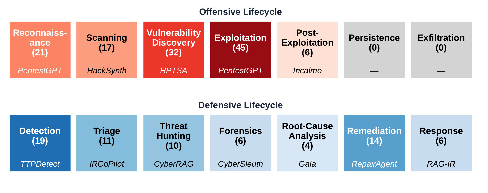
</div>

Research clusters around stages that reward code generation and immediate feedback. Exploitation is the most covered offensive stage (45 papers), followed by vulnerability discovery (32) and reconnaissance (21). Persistence and exfiltration are nearly absent from the literature. On the defensive side, detection (19) and alert triage (11) are best covered, while root-cause analysis (4) and automated response (6) remain thin. Both lifecycles show that stages requiring sustained reasoning or stealth receive little attention.

**Offense-Defense Autonomy Asymmetry**

<div align="center">
    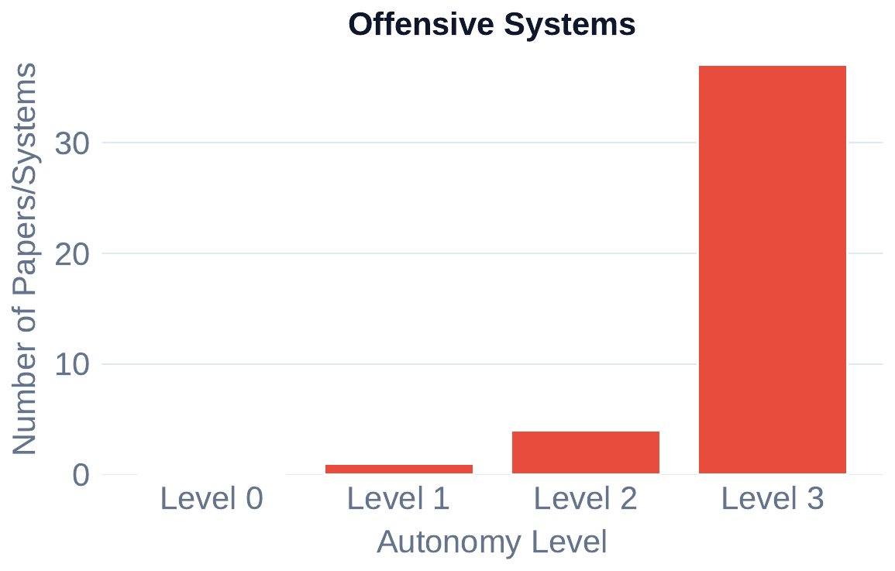
    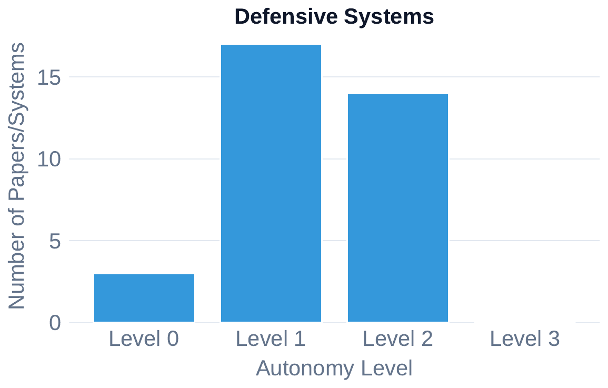
    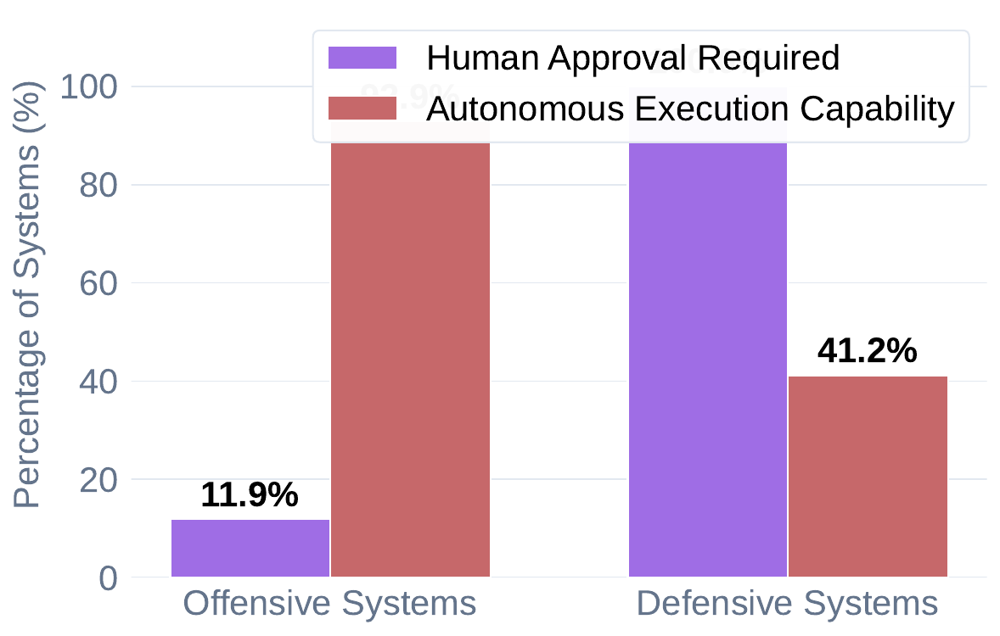
</div>

88.1% of offensive systems operate at Level 3 (fully autonomous), while 0% of defensive systems reach that level — 50% remain at Level 1 (copilot). 100% of defensive systems maintain human-in-the-loop controls; only 11.9% of offensive systems require human approval. This gap reflects fundamentally different design priorities: offense optimizes for end-to-end task completion while defense prioritizes safety and accountability.

**Dual-Use Red-Teaming**

<div align="center">
    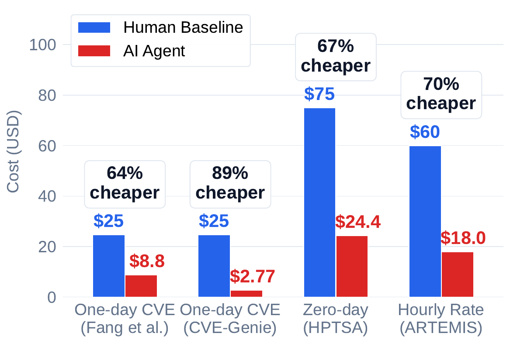
    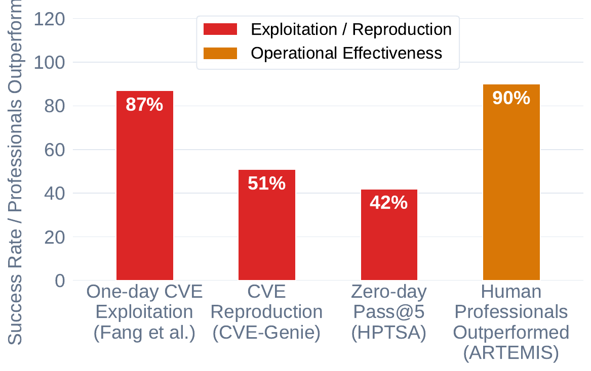
    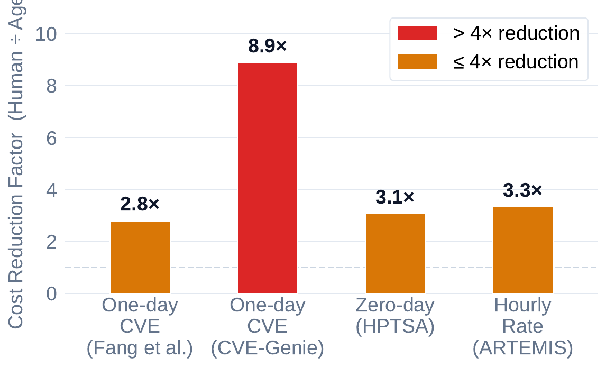
</div>

55.3% of application systems expose capabilities that are directly offensive or broadly dual-use. AI agents reduce exploitation cost by 2.8×–8.9× versus human baselines: a single agent exploits 87% of one-day CVEs at ~$8.80 each, and ARTEMIS operates at $18/hr versus $60/hr for human testers. Three key shifts emerge: reduced cost, increased scalability through parallel multi-agent execution, and a lower skill floor as agentic scaffolding enables operations that previously required expert operators.

---

### Threats Analysis

**Entry Points of the Attack Surface**

<div align="center">
    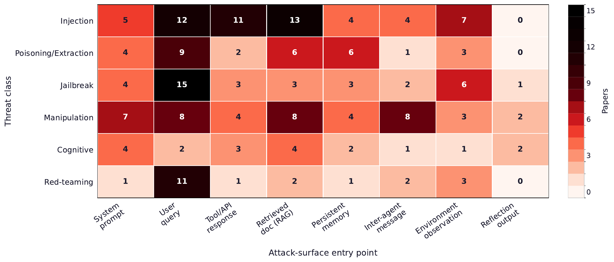
</div>

The conversational input (user query + system prompt) is the most attacked entry point, accounting for 55% of evaluated attacks — largely because it requires no special infrastructure to study. Among agent-specific surfaces, the retrieved document (RAG) is the leading autonomous attack vector (15 papers), the environment observation is rapidly growing (14 papers), and the tool/API response is rising with the Model Context Protocol (11 papers). Inter-agent communication (8 papers) and persistent memory (4 papers) remain the most underexplored yet distinctly agentic surfaces.

**Agent Loop Failure Stages**

<div align="center">
    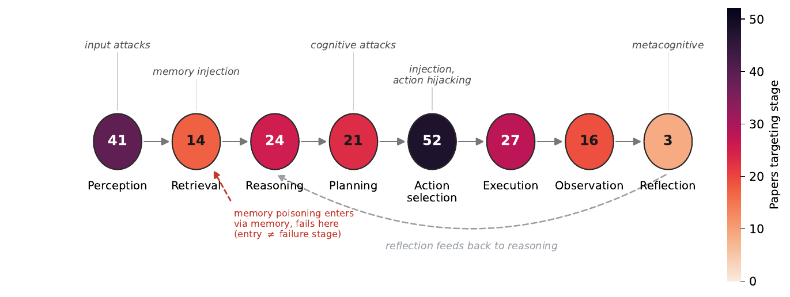
</div>

Action selection is the most targeted stage (52 papers), followed by perception (41). Intermediate stages — retrieval (14), reasoning (24), planning (21) — are less studied, creating a coverage gap. Attacks that manifest at these internal stages are especially dangerous because they subvert agent logic while leaving the final output clean. Reflection output is the least-targeted stage of all, with only 3 papers.

**Threat Specificity**

<div align="center">
    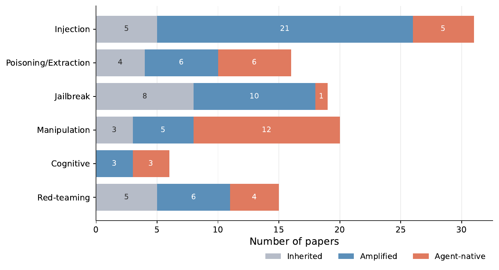
</div>

67% of the attacks studied are either inherited from the base LLM (e.g., chatbot jailbreak templates ported to agents) or amplified by wrapping a safety-aligned model in an agentic framework. Only 25% are genuinely agent-native. Empirically, non-denial rates jump from 0% in standalone models to 46.6% when tested as a web agent; GPT-4o's harmful-behavior rate rises from 12% in chat to 74% as a browser agent. The five mechanisms of agent-native threats are: persistent-state poisoning, inter-agent compromise, tool/protocol-layer poisoning, plan and action hijacking, and specification/reward gaming.

**Benchmark Fragmentation**

Of 69 threat papers, 52% carry a benchmarking role, yet 108 distinct benchmarks are named across them and 92% are used by exactly one paper. Only three dedicated agentic-security benchmarks (AgentDojo, InjecAgent, WebArena) appear in more than two papers. The surfaces most specific to agents — persistent memory, inter-agent messaging, reflection — are both least attacked and least benchmarked.

---

### Defenses Analysis

**Defense Strategies and Coverage**

<div align="center">
    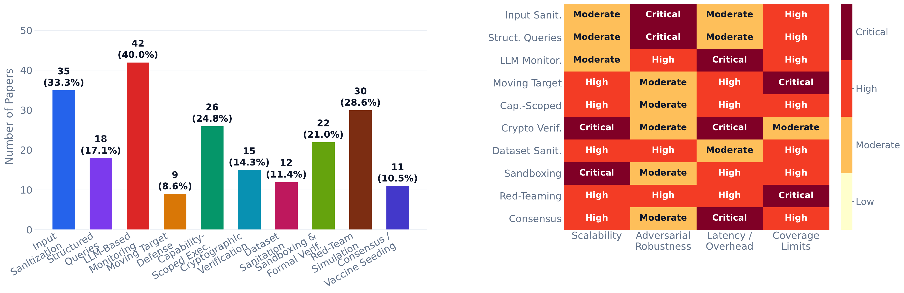
</div>

Ten defense strategies emerge across 105 papers. LLM-Based Monitoring is the largest category (40%), followed by Input Sanitization (33%) and Red-Team Simulation (29%). Moving Target Defense (8.6%) and Consensus/Vaccine Seeding (10.5%) are the least explored. No single strategy achieves uniformly low severity across scalability, adversarial robustness, latency, and coverage — motivating multi-layer hybrid architectures.

**Defense Coverage by Attack Category**

<div align="center">
    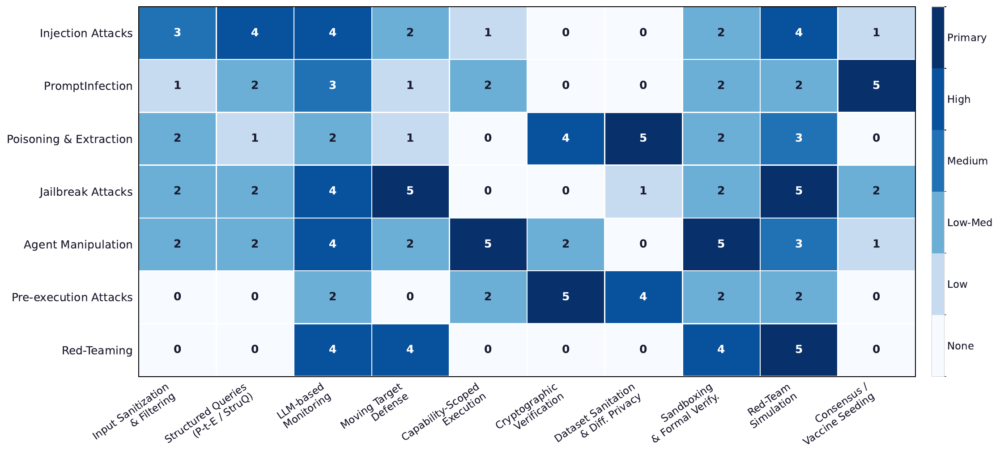
</div>

Injection Attacks receive the most defensive attention (35 papers) and Agent Manipulation Attacks come second (32), reflecting their overlap: prompt injection is the dominant vehicle for tool-execution hijacking. PromptInfection (9 papers) and Pre-execution Attacks (12 papers) remain the most underdefended. The best defenses against each attack type: Structured Query + LLM Monitoring for injection; Capability-Scoped Execution + Sandboxing for manipulation; Cryptographic Verification for pre-execution; Consensus/Vaccine Seeding for prompt infection.

**Defense Architecture**

<div align="center">
    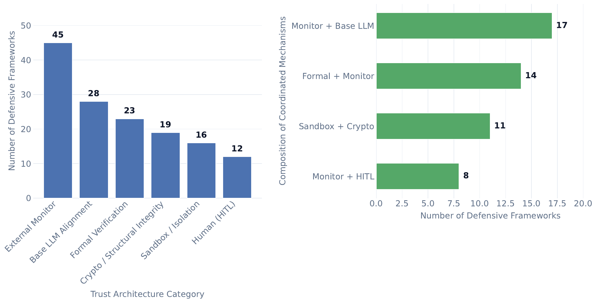
</div>

Six structural compositions are identified: Base LLM Alignment, External Monitor, Formal Verification, Sandbox/Isolation, Cryptographic/Structural Integrity, and Human-in-the-Loop. The 18-paper overlap between Injection Attacks and Agent Manipulation Attacks confirms that prompt injection remains the dominant vehicle for tool-execution hijacking across the corpus. The most cost-effective deployments layer lightweight filters (e.g., PPA at ~0.06 ms) before expensive LLM-based reasoning.

---

### Cross-Cutting Trends

**Agent Cardinality & Autonomy**

<div align="center">
    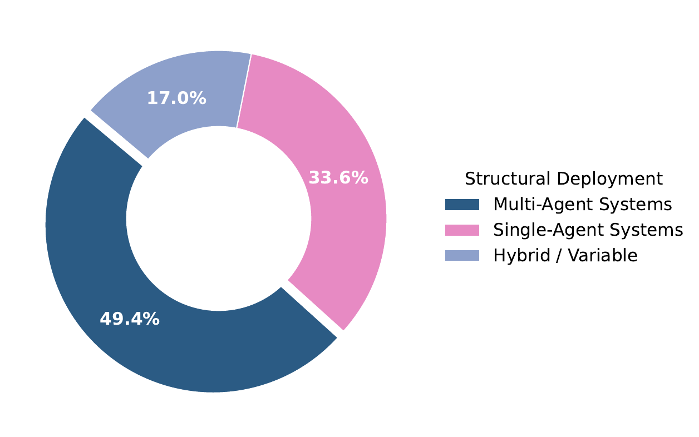
    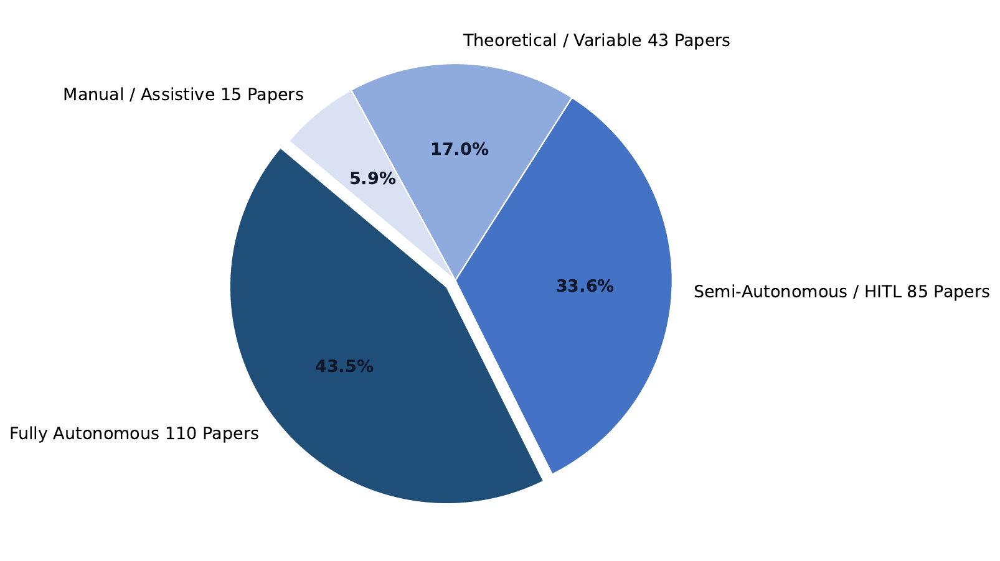
</div>

Multi-agent systems dominate the corpus (49.4%), followed by single-agent (33.6%) and hybrid (17%). Fully autonomous systems represent 43.5% of surveyed work; semi-autonomous 33.6%. The field is migrating from monolithic single-agent ReAct loops toward planner-executor and hybrid architectures, which better handle long-horizon tasks but introduce new coordination and trust-boundary vulnerabilities.

**Architectural Paradigms & Roles**

<div align="center">
    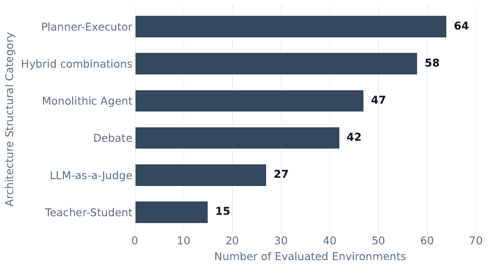
    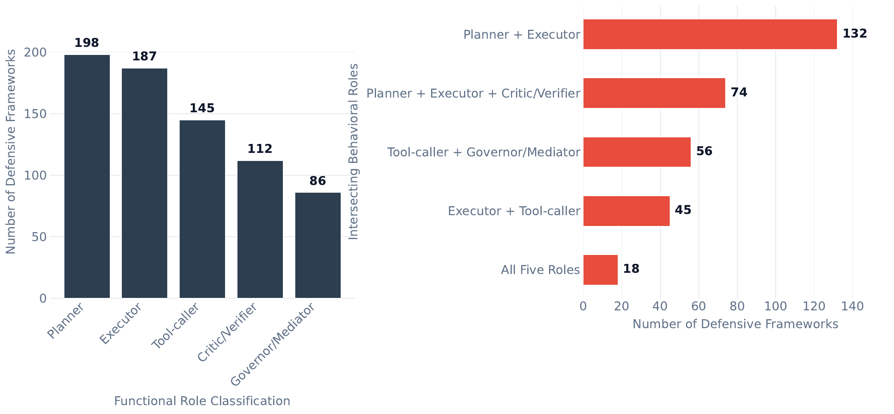
</div>

Planner-executor (25.3%) and hybrid (22.9%) paradigms dominate over monolithic (18.6%) and debate-centric (16.6%) designs. Averaging 2.88 cognitive roles per paper, modern pipelines are multi-functional: planners appear in 78.3% of papers, executors in 73.9%, tool-callers in 57.3%. High overlap between roles means a single vulnerability often exposes multiple attack surfaces simultaneously.

**LLM Usage & Knowledge Sources**

<div align="center">
    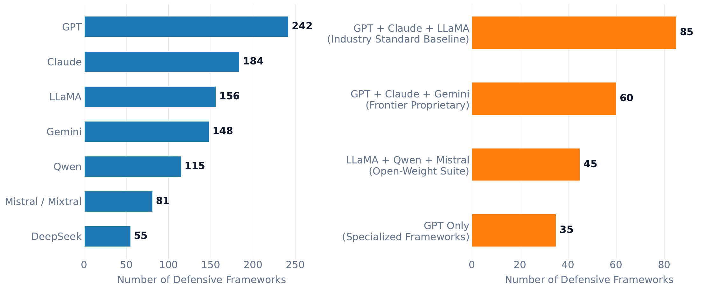
    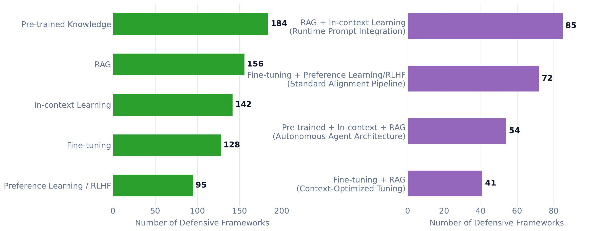
</div>

GPT variants appear in 95.7% of papers, creating a near-monopoly that raises reproducibility and generalization concerns. Claude (72.7%), LLaMA (61.7%), and Gemini (58.5%) follow. RAG is used in 61.7% of papers; pre-trained knowledge in 72.7%; in-context learning in 56.1%. The dominant pipeline combines pre-trained knowledge, ICL, and RAG — and this combination is also the most vulnerable to vector database poisoning and adversarial context injection.

**Data Modalities**

<div align="center">
    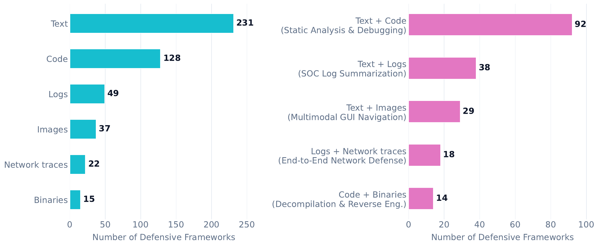
</div>

Text (91.3%) and Code (50.6%) dominate, while Network Traces (8.7%) and Binaries (5.9%) are underrepresented. Text+Code is by far the most common pairing, reflecting a bias toward static source auditing. Active end-to-end network and binary runtime security remains a significant coverage gap.

**Temporal Distribution**

<div align="center">
    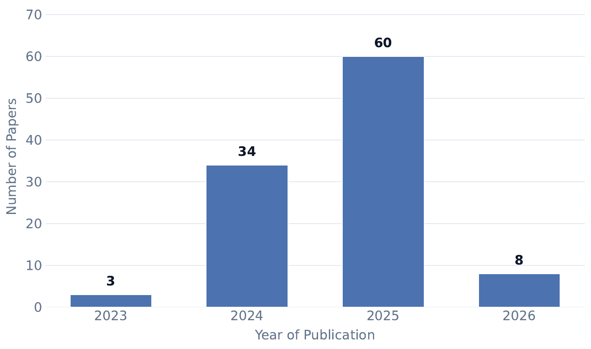
    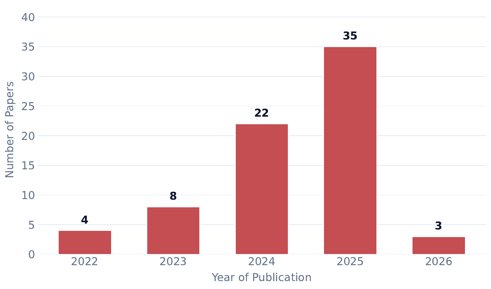
</div>

Defense research accelerated sharply: 34 papers in 2024, 60 in 2025. Threat research grew from 4 papers in 2022 to 22 in 2024 and 35 in 2025. Both trajectories show rapid escalation, but the temporal gap between new attacks and corresponding defenses remains a persistent challenge for practitioners.

---

## Contributors

<a href="https://github.com/kagnlp/Awesome-Agentic-Security/graphs/contributors">
    
</a>

If you find this survey or repository useful, please cite our work:

```bibtex
@article{shahriar2025agentic,
  title={A Survey on Agentic Security: Applications, Threats and Defenses},
  author={Shahriar, Asif and Rahman, Md Nafiu and Ahmed, Sadif and Sadeque, Farig and Parvez, Md Rizwan},
  journal={arXiv preprint arXiv:2510.06445},
  year={2025}
}
```